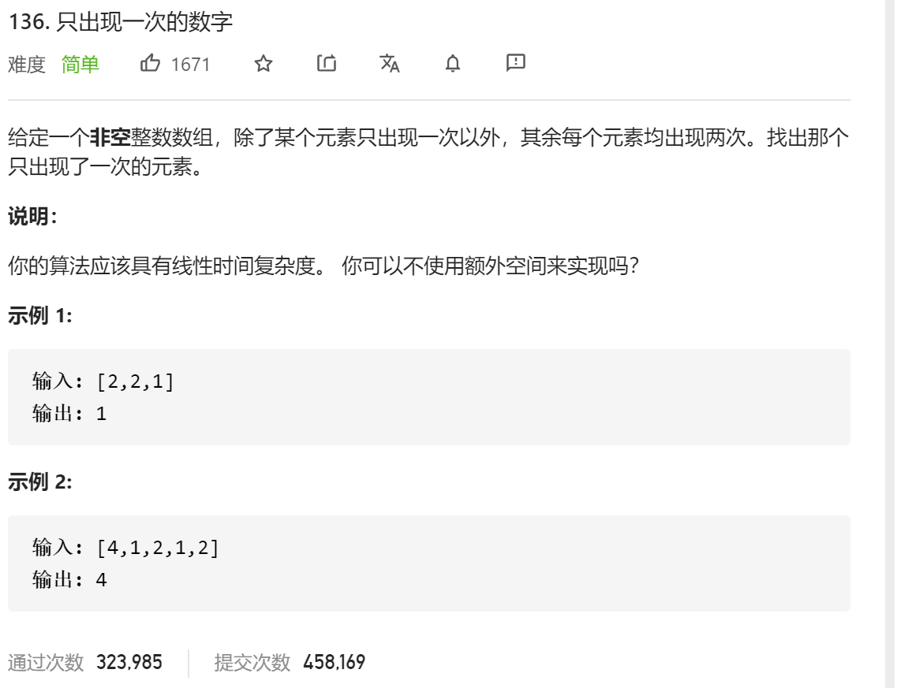

### leetcode_136_easy_只出现一次的数字



```c++
class Solution {
public:
    int singleNumber(vector<int>& nums) {

    }
};
```

#### 算法思路

考察**位运算**，详见 位运算.md

```c++
class Solution {
public:
	int singleNumber(vector<int>& nums) {
		int i, result;
		for (i = 0, result = 0; i < nums.size(); i++)
			result = result ^ nums[i];
		return result;
	}
};
```

