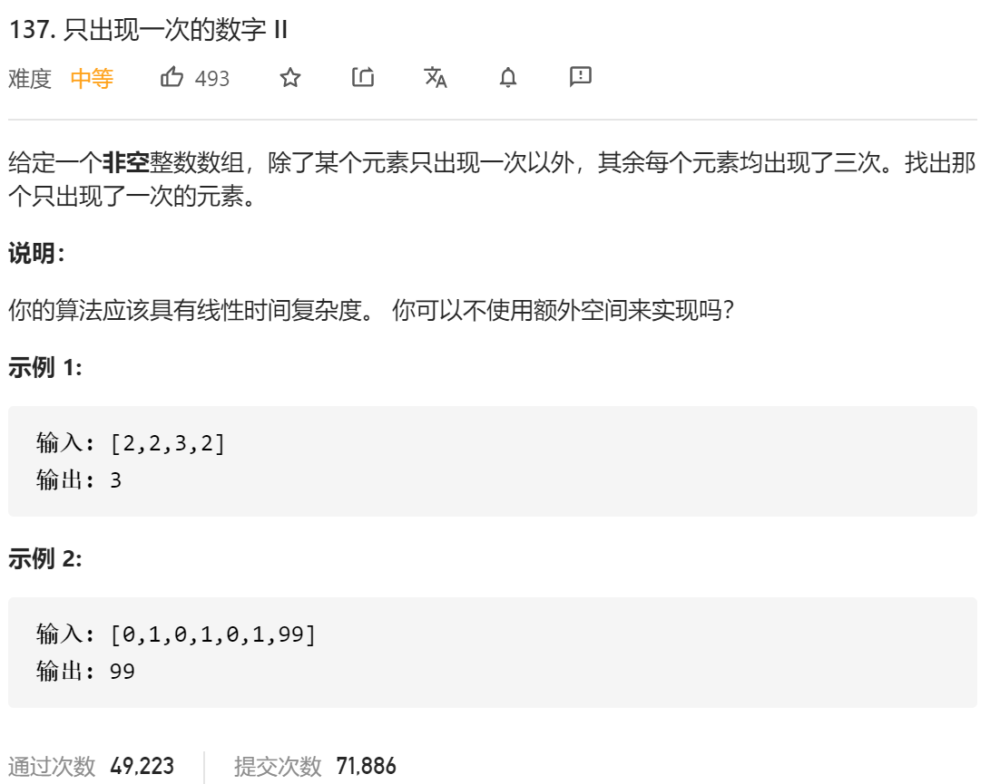

### leetcode_137_medium_只出现一次的数字 Ⅱ



```c++
class Solution {
public:
    int singleNumber(vector<int>& nums) {

    }
};
```

#### 位运算

https://leetcode-cn.com/problems/single-number-ii/solution/zi-dong-ji-wei-yun-suan-zui-xiang-xi-de-tui-dao-gu/

看不懂 告辞

