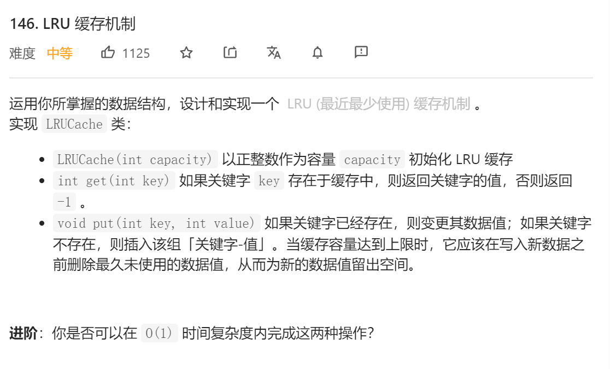
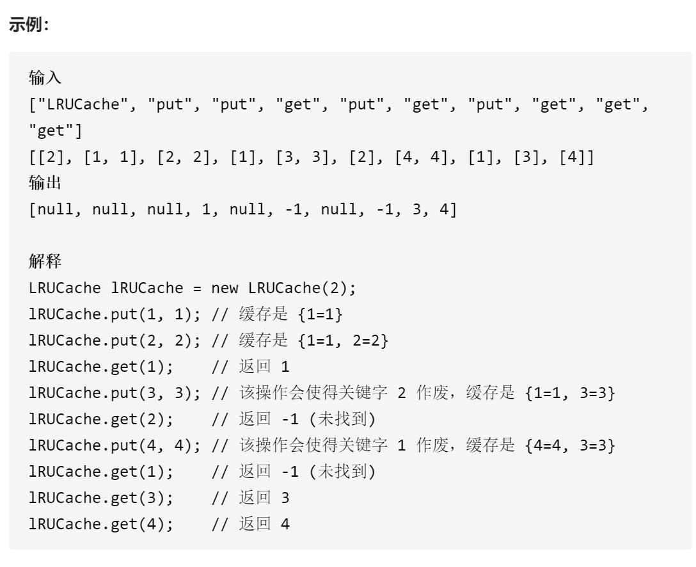
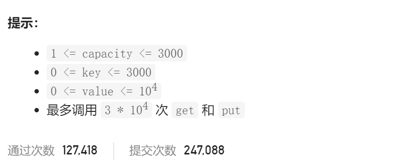

### leetcode_146_medium_LRU缓存机制







#### 算法思路

查找操作要求O(1)时间复杂度，那么必须用到hashmap。

插入操作要求O(1)时间复杂度。考虑插入操作 需要丢弃“最近最少使用”的一个节点。那么，也就是说，**数据结构只维护最近使用过的capacity个节点**。那么 可以使用**链表**结构。每查找/插入一个节点，都将该节点放到链表头。

注意检测以下测试用例

```
["LRUCache","put","get","put","get","get"]
[[1],[2,1],[2],[3,2],[2],[3]]
```

```
["LRUCache","put","put","put","put","get","get"]
[[2],[2,1],[1,1],[2,3],[4,1],[1],[2]]
```

```c++
//链表类
class Node {
public:
	Node():key(0),val(0),next(nullptr),former(nullptr) {}
	Node(int key,int value) :key(key),val(value),next(nullptr),former(nullptr) {}
	Node(int key, int value, Node *former, Node *next) :key(key), val(value), former(former), next(next) {}
	int key;
	int val;
	Node *next;
	Node *former;
};

class LRUCache {
public:
	LRUCache(int capacity) {
		m_capacity = capacity;
		m_dummyHead = new Node(-1,-1);
		m_rear = m_dummyHead;
	}

	//将某个节点添加至队首
	void addNode(int key,int val)
	{
		Node *node = new Node(key, val, m_dummyHead, m_dummyHead->next);
		if (m_dummyHead->next)  
			m_dummyHead->next->former = node;
		else
			m_rear = node;  //初始化尾节点
		m_dummyHead->next = node;
		m_map[key] = node;
	}

	//删除某个节点
	void removeNode(Node* node)
	{
		node->former->next = node->next;
		if (node->next)
			node->next->former = node->former;
		if (node == m_rear)
			m_rear = m_rear->former;
		m_map.erase(node->key);
		delete node;
	}

	int get(int key) {
		if (m_map.find(key) == m_map.end())  //该key不存在 直接返回-1
		{
			return -1;
		}
		else  //该key存在，则将该节点移至队头
		{
			Node *foundNode = m_map[key];
			int value = foundNode->val;
			//从原位置删除节点
			this->removeNode(foundNode);
			//在队首添加节点
			this->addNode(key, value);

			return value;
		}
	}

	void put(int key, int value) {
		if (m_map.find(key) != m_map.end())  //如果关键字已存在 则变更其数据值
		{
			m_map[key]->val = value;
			this->removeNode(m_map[key]);  //删除该节点
			this->addNode(key, value);  //将节点重新添加至队首
		}
		else  //如果关键字不存在 则插入该[关键字-数值]对
		{
			if (m_map.size() == m_capacity)  //如果容量已满，则需要移除一个节点
				this->removeNode(m_rear);
			this->addNode(key, value);  //将节点添加至队首
		}
	}

private:
	int m_capacity;  //允许的最大数据量
	unordered_map<int, Node*> m_map;  //由 key 到 相应链表节点的映射
	Node *m_dummyHead;  //链表头结点的前驱节点
	Node *m_rear;  //链表尾节点
};
```

