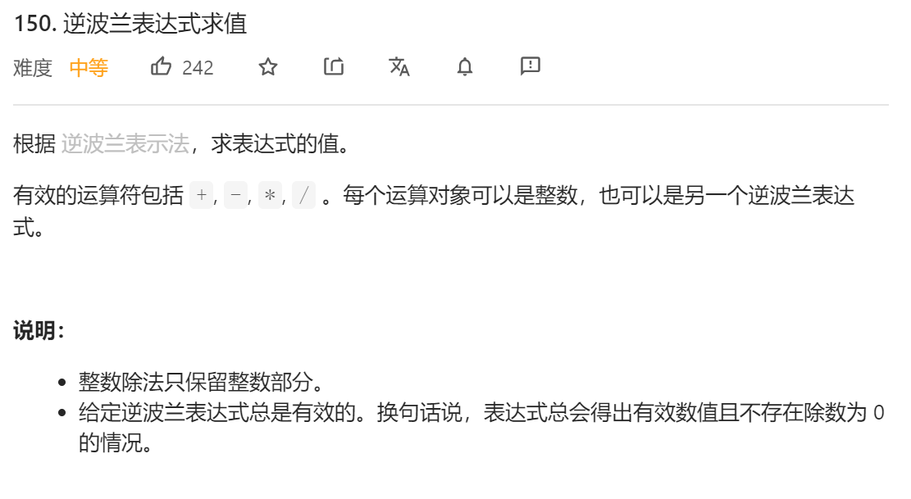
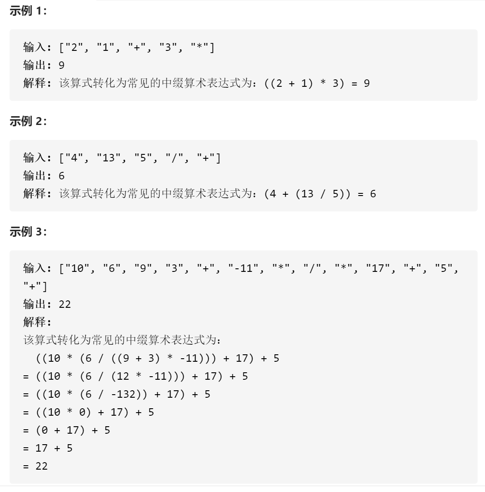
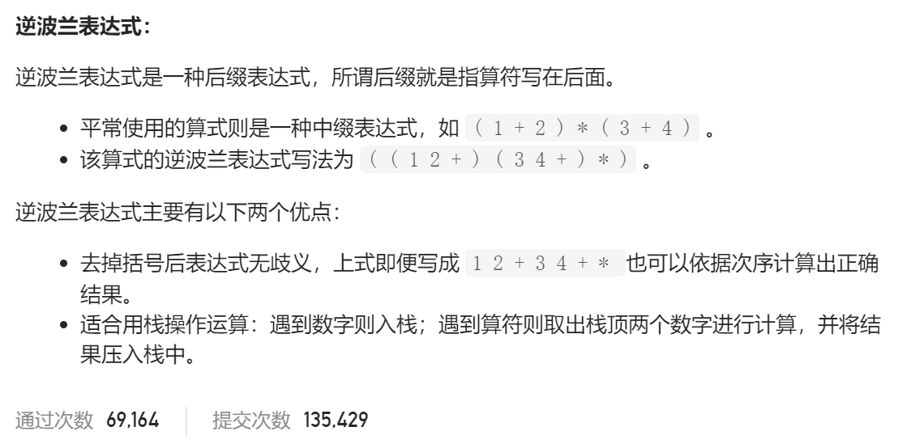

### leetcode_150_medium_逆波兰表达式求值







```c++
class Solution {
public:
    int evalRPN(vector<string>& tokens) {

    }
};
```

#### 算法思路

构造一个数值栈。读取到数字则入栈。遇到算符 则取两个数字计算

```c++
class Solution{
public:
	int evalRPN(vector<string>& tokens) {
		int i, num1, num2;
		stack<int> nums;
		string curStr;
		set<string> operators{ "+","-","*","/" };

		for (i = 0; i < tokens.size(); i++)
		{
			curStr = tokens[i];
			if (operators.find(curStr) != operators.end())
			{
				num2 = nums.top();
				nums.pop();
				num1 = nums.top();
				nums.pop();
				if (curStr == "+")
					nums.push(num1 + num2);
				else if (curStr == "-")
					nums.push(num1 - num2);
				else if (curStr == "*")
					nums.push(num1*num2);
				else
					nums.push(num1 / num2);
			}
			else
				nums.push(stoi(curStr));
		}
		return nums.top();
	}
};

```

