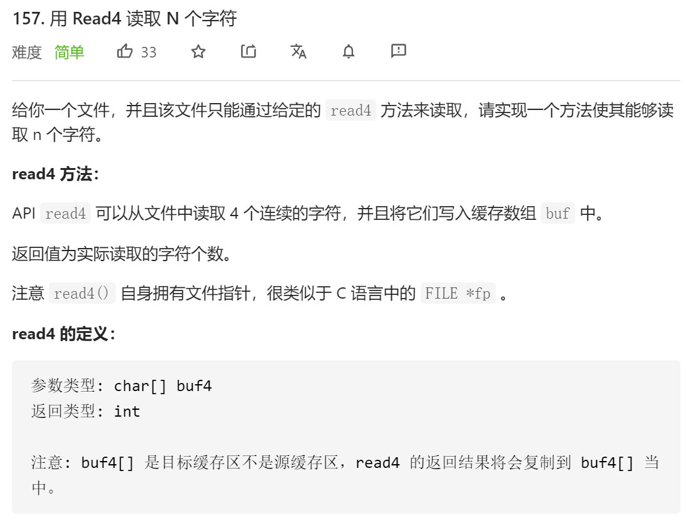
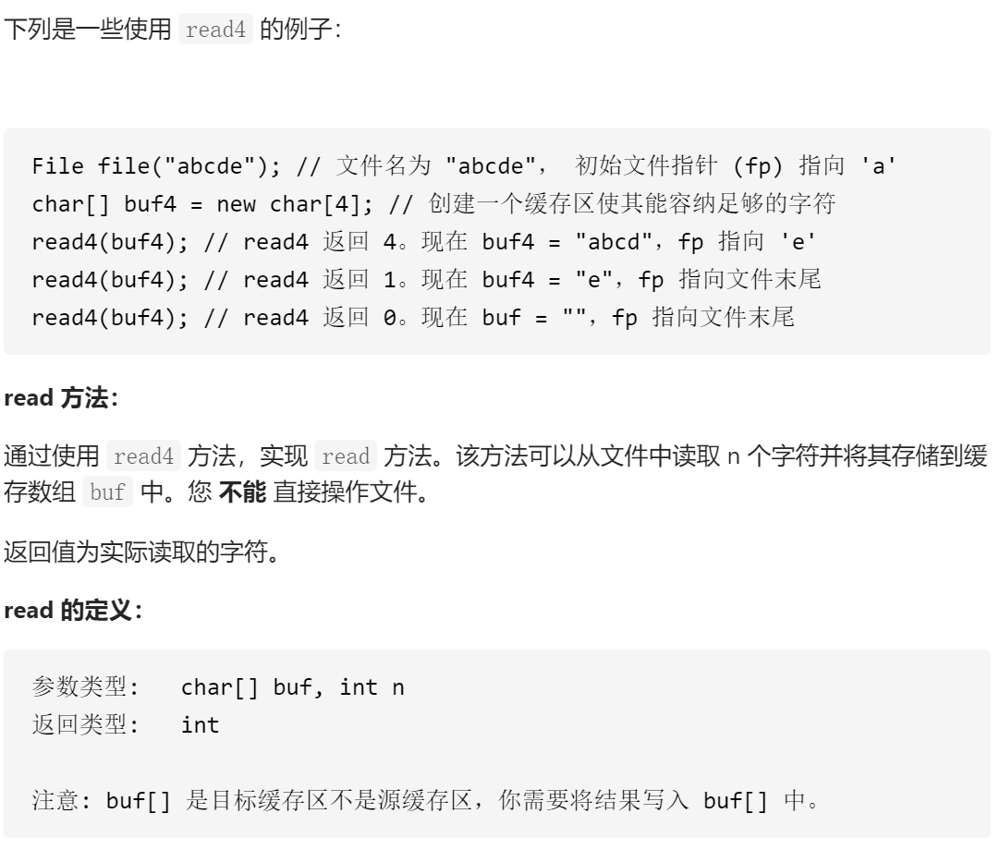
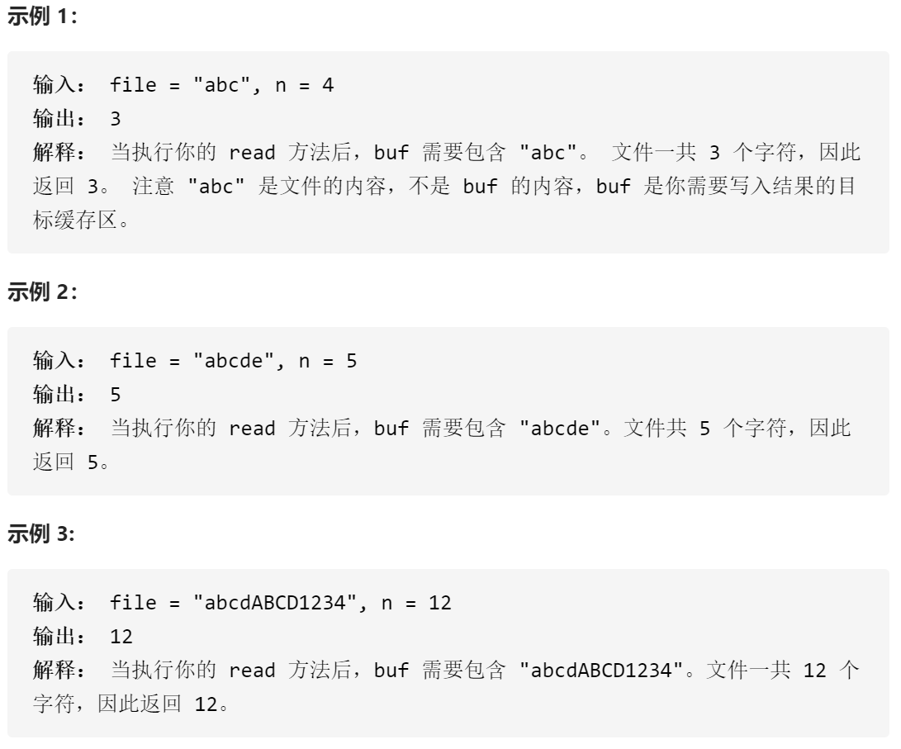
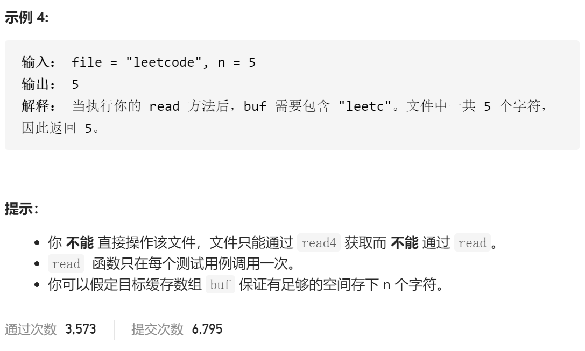

### leetcode_157_easy_用Read4读取N个字符









```c++
/**
 * The read4 API is defined in the parent class Reader4.
 *     int read4(char *buf4);
 */

class Solution {
public:
    /**
     * @param buf Destination buffer
     * @param n   Number of characters to read
     * @return    The number of actual characters read
     */
    int read(char *buf, int n) {
        
    }
};
```

#### 算法思路

只要同时满足下列条件，则持续读取字符

- 读入总字符数未达到n
- 文件中仍有字符可供读取

```c++
class Solution {
public:
	/**
	 * @param buf Destination buffer
	 * @param n   Number of characters to read
	 * @return    The number of actual characters read
	 */
	int read(char *buf, int n) {
		int curCharNum, charNeed;
		char buf4[4];  //用于读取4个数据的缓冲区

		charNeed = n;  //还需要读取的字符数
		while (charNeed > 0 && (curCharNum = read4(buf4)))
		{
			memcpy(buf, buf4, sizeof(char)*min(charNeed, curCharNum));
			buf += min(charNeed, curCharNum);
			charNeed -= min(charNeed, curCharNum);
		}
		return n - charNeed;
	}
};
```

