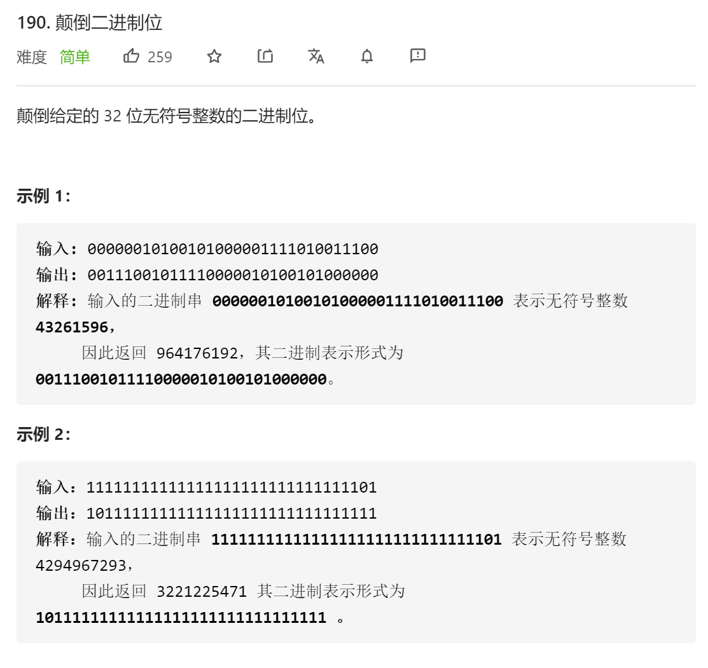
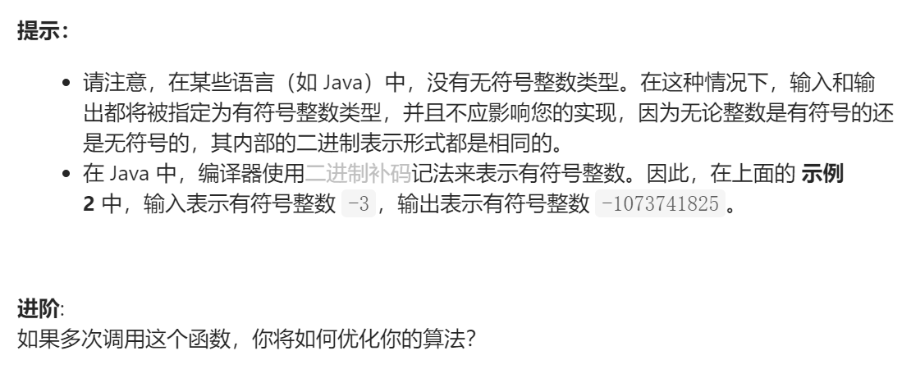

### leetcode_190_easy_颠倒二进制位





```c++
class Solution {
public:
    uint32_t reverseBits(uint32_t n) {
        
    }
};
```

#### 算法思路

按位颠倒。考察位运算

```c++
class Solution {
public:
	uint32_t reverseBits(uint32_t n) {
		int i;
		uint32_t result;
		vector<int> digits(32,0);

		//取n的每一位 digits[0]为最低位
		i = 0;
		while (n != 0)
		{
			digits[i++] = n & 1;  //取n的最末位
			n = n >> 1;
		}
		//返回翻转结果，digits[0]为最高位
		for (i = 0, result = 0; i < 32; i++)
		{
			result = result << 1;
			result += digits[i];
		}
		return result;
	}
};
```

