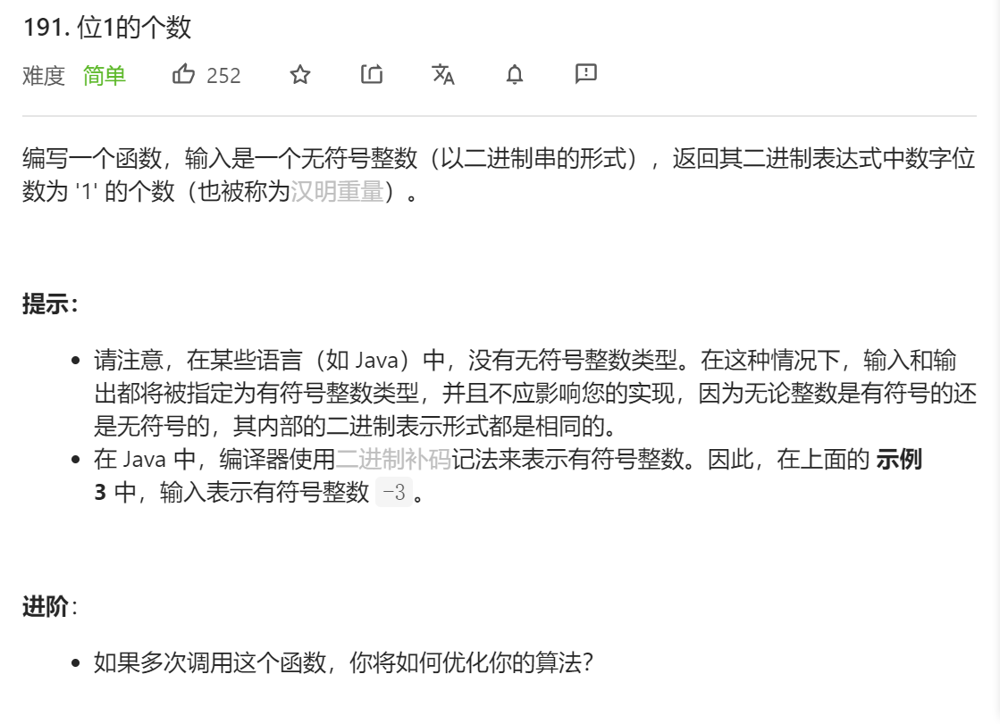
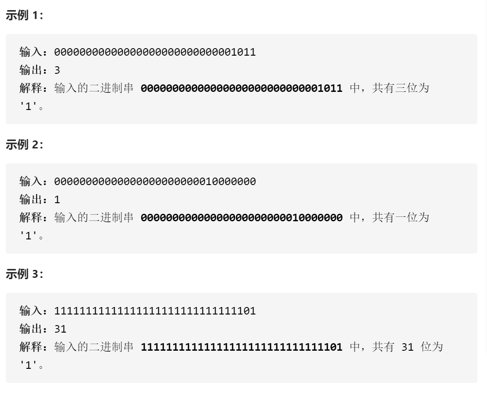

### leetcode_191_easy_位1的个数






```c++
class Solution {
public:
    int hammingWeight(uint32_t n) {
        
    }
};
```

#### 算法思路

按位计算1的数量。考察位运算

```c++
class Solution {
public:
	int hammingWeight(uint32_t n) {
		int result = 0;
		while (n > 0)
		{
			if (n & 1)
				++result;
			n = n >> 1;
		}
		return result;
	}
};

```

