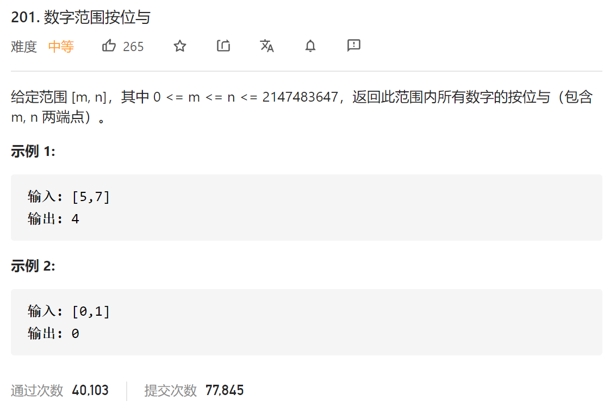

### leetcode_201_medium_数字范围按位与



```c++
class Solution {
public:
    int rangeBitwiseAnd(int m, int n) {

    }
};
```

#### 算法思路

范围内所有数字按位与，相当于是求范围内所有数字 其二进制串的公共前缀，此外的部分补0。因为，对于非公共前缀的部分，‘1’和‘0’交替出现，按位与的结果比为0。

关于如何求公共前缀，采用移位的方法。将m、n右移，直到m、n相等。再左移回到原来的长度即可

```c++
class Solution {
public:
	int rangeBitwiseAnd(int m, int n) {
		int d = 0;  //移位的位数

		while (m != n)
		{
			m = m >> 1;
			n = n >> 1;
			d++;
		}
		return m << d;
	}
};
```

