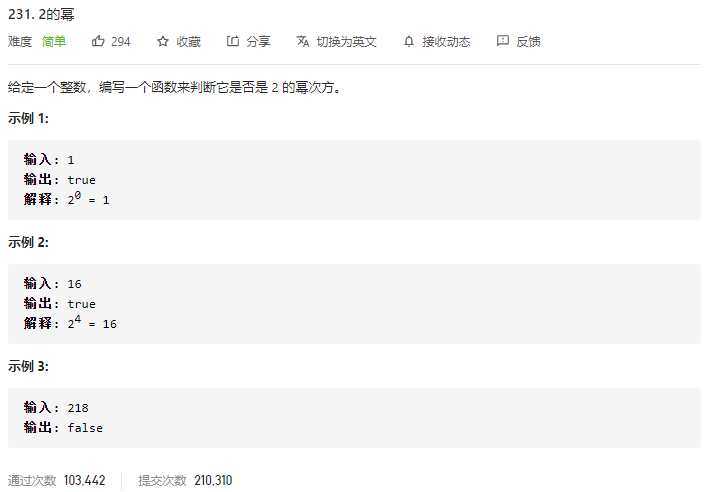

### leetcode_231_easy_2的幂



```c++
class Solution {
public:
    bool isPowerOfTwo(int n) {

    }
};
```

#### 算法思路

考察位运算。这个整数的2进制形式是否只有1个1

```c++
class Solution {
public:
    bool isPowerOfTwo(int n) {
        if(n<=0)
            return false;
        while(n)
        {
            if(n&1)
                break;
            else
                n=n>>1;
        }
        n=n>>1;
        return n==0;
    }
};
```

