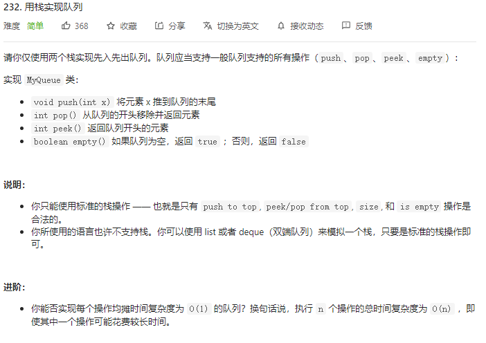
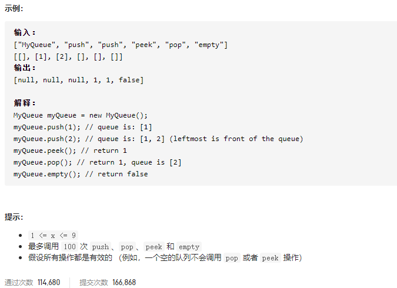

### leetcode_232_easy_用栈实现队列





```c++
class MyQueue {
public:
    /** Initialize your data structure here. */
    MyQueue() {

    }
    
    /** Push element x to the back of queue. */
    void push(int x) {

    }
    
    /** Removes the element from in front of queue and returns that element. */
    int pop() {

    }
    
    /** Get the front element. */
    int peek() {

    }
    
    /** Returns whether the queue is empty. */
    bool empty() {

    }
};
```

#### 算法思路

参考 https://leetcode-cn.com/problems/implement-queue-using-stacks/solution/yong-zhan-shi-xian-dui-lie-by-leetcode-s-xnb6/

将一个栈当作输入栈，用于压入push 传入的数据；另一个栈当作输出栈，用于pop 和 peek 操作。

每次pop 或peek 时，若输出栈为空则将输入栈的全部数据依次弹出并压入输出栈，这样输出栈从栈顶往栈底的顺序就是队列从队首往队尾的顺序。

```c++
class MyQueue {
public:
    /** Initialize your data structure here. */
    MyQueue() {

    }
    
    /** Push element x to the back of queue. */
    void push(int x) {
        stkIn.push(x);
    }
    
    /** Removes the element from in front of queue and returns that element. */
    int pop() {
        int result;
        if(stkOut.empty())
            this->moveData();
        result=stkOut.top();
        stkOut.pop();
        return result;
    }
    
    /** Get the front element. */
    int peek() {
        if(stkOut.empty())
            this->moveData();
        return stkOut.top();
    }
    
    /** Returns whether the queue is empty. */
    bool empty() {
        return stkIn.empty() && stkOut.empty();
    }

private:
    //将数据从输入栈移动至输出栈
    void moveData()
    {
        while(!stkIn.empty())
        {
            stkOut.push(stkIn.top());
            stkIn.pop();
        } 
    }


private:
    stack<int> stkIn;  //存储已输入数据
    stack<int> stkOut;  //存储待输出数据
};
```

