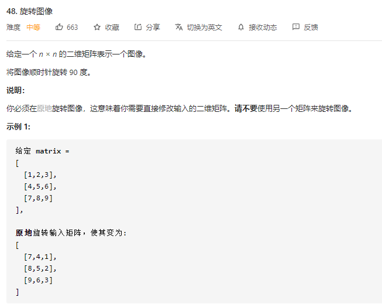
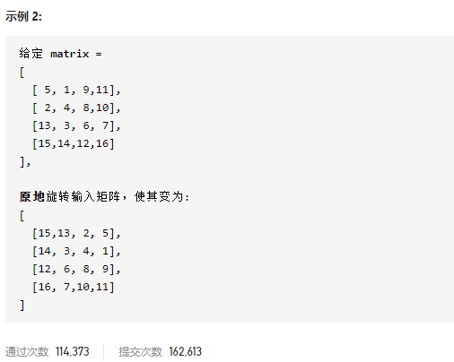

### leetcode_48_medium_旋转图像





```c++
class Solution {
public:
    void rotate(vector<vector<int>>& matrix) {
        
    }
};
```

#### 算法思路

顺时针旋转90°，可以由两次翻转操作复合得到

1. 沿主对角线翻转一次
2. 水平翻转一次

```c++
class Solution {
public:
	void rotate(vector<vector<int>>& matrix) {
		int y, x;
		int size = matrix.size();

		//沿主对角线翻转
		for (y = 0; y < size; y++)
			for (x = 0; x < y; x++)
				swap(matrix[y][x], matrix[x][y]);
		//水平翻转
		for (y = 0; y < size; y++)
			for (x = 0; x < size/2; x++)
				swap(matrix[y][x], matrix[y][size - x - 1]);
	}
};
```

