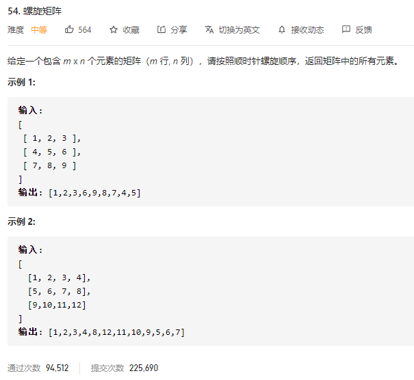

### leetcode_54_medium_螺旋矩阵



```c++
class Solution {
public:
    vector<int> spiralOrder(vector<vector<int>>& matrix) {

    }
};
```

#### 算法思路

螺旋顺序，即指针按照 右->下->左->上 的顺序移动，直到访问到所有元素为止

当按照之前的方向，找到即将访问的下一个位置时，需要检测下一个位置的合法性。不合法的情况有三种

- 所有的元素都已经访问完毕。这可能导致指针越界或者指向已访问过的元素。此时直接return result即可
- 这一圈，这个方向已经访问完毕。这可能导致指针越界或者指向已访问过的元素。换个方向即可。例如，对于示例1，访问完节点matrix[0] [1]=4之后，下一个待访问的节点并不是matrix[0] [0]=1，而应该调转方向，访问matrix[1] [1]=5。

```c++
class Solution {
public:
	vector<int> spiralOrder(vector<vector<int>>& matrix) {
		int dir = 0, width, height, y, x, newY, newX;
		static int dx[4]{ 1,0,-1,0 };
		static int dy[4]{ 0,1,0,-1 };
		vector<int> result;

		if (matrix.empty() || matrix[0].empty())
			return result;
		height = matrix.size();
		width = matrix[0].size();
		dir = 0;  //初始状态，方向为向右
		y = x = 0;  //始于左上角
		while (true)
		{
			//访问当前节点
			result.push_back(matrix[y][x]);
			matrix[y][x] = INT_MIN;  //标志着该位置已经访问过了
			//寻找下一个待访问的节点
			newX = x + dx[dir];
			newY = y + dy[dir];
			if(newX <0|| newX >=width|| newY<0|| newY >=height||matrix[newY][newX]==INT_MIN)  //如果这个位置非法
			{
				if (result.size() == width * height)  //已经访问完毕的情况
					return result;
				dir = (dir + 1) % 4;  //未访问完完毕，但是需要换个方向的情况
				newX = x + dx[dir];
				newY = y + dy[dir];
			}
			x = newX;
			y = newY;
		}
		return result;  //不可能跑到这行。
	}
};
```

