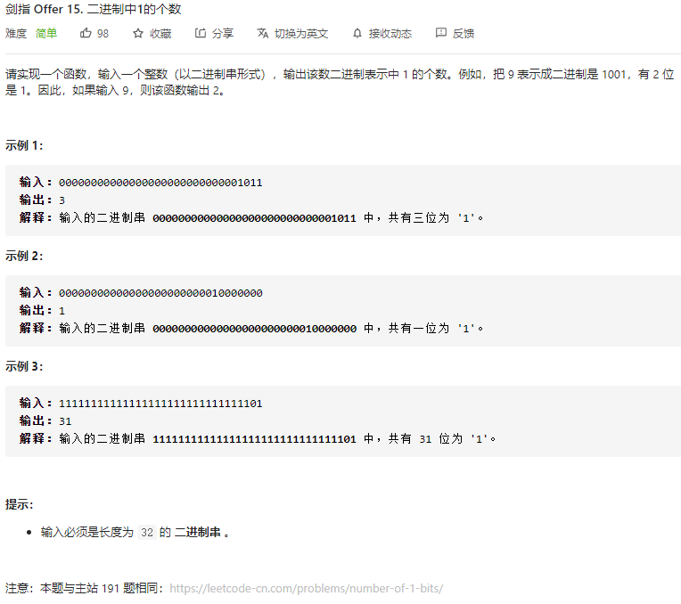

### 剑指offer_15_easy_二进制中1的个数



```c++
class Solution {
public:
    int hammingWeight(uint32_t n) {
        
    }
};
```

#### 算法思路

同 leetcode_191_easy_位1的个数

```c++
class Solution {
public:
    int hammingWeight(uint32_t n) {
        int result=0;
        while(n)
        {
            if(n&1)
                ++result;
            n=n>>1;
        }
        return result;
    }
};
```

