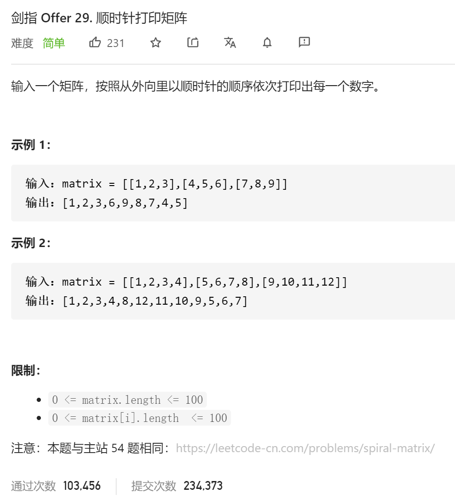

### 剑指offer_29_easy_顺时针打印矩阵



```c++
class Solution {
public:
    vector<int> spiralOrder(vector<vector<int>>& matrix) {

    }
};
```

#### 算法思路

同 leetcode_54_medium_螺旋矩阵

```c++
class Solution {
public:
    vector<int> spiralOrder(vector<vector<int>>& matrix) {
        int dir;  //方向，0,1,2,3表示右、下、左、上四个方向
        int y,x,newY,newX,width,height;
        static pair<int,int> step[4]{{1,0},{0,1},{-1,0},{0,-1}};  //{dx,dy}
        vector<vector<bool>> visited;
        vector<int> result;

        y=0;
        x=0;
        dir=0;
        if(matrix.empty()||matrix[0].empty())
            return result;
        height=matrix.size();
        width=matrix[0].size();
        visited=vector<vector<bool>>(height,vector<bool>(width,false));
        while(result.size()<=width*height)
        {
            result.push_back(matrix[y][x]);
            visited[y][x]=true;
            if(result.size()==width*height)
                break;
            //寻找下一个待访问的位置
            while(true)
            {
                newX=x+step[dir].first;
                newY=y+step[dir].second;                
                if(newY>=0 && newY<height && newX>=0 && newX<width && !visited[newY][newX])  //该位置合法
                break;
                dir=(dir+1)%4;  //当前方向不合法的话，就换个方向
            }
            x=newX;
            y=newY;
        }
        return result;
    }
};
```

