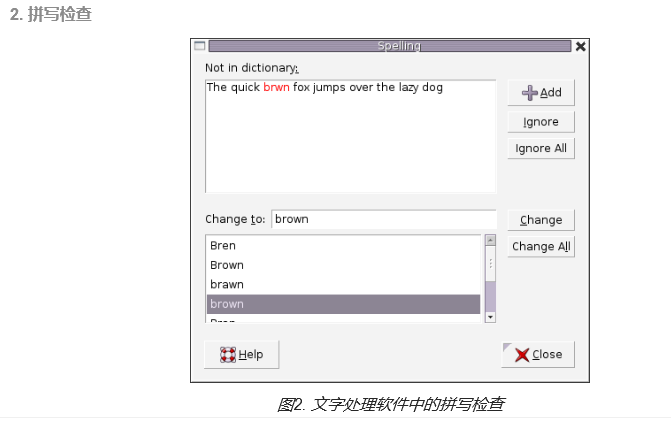

### Trie树

**Trie树** 又称**字典树**或**前缀树**，是一种有序的，用于统计、排序和存储字符串的数据结构。不同于二叉查找树，Trie树关键字不是直接保存在节点中，而是由节点在树中的相对位置决定。


### 用途

Trie树可用于用于检索字符串数据集中的键。





### 优点

还有其他的数据结构，如平衡树和哈希表，能够用于在字符串数据集中搜索单词。但是，尽管哈希表可以在 O(1) 时间内寻找键值，却无法高效的完成以下操作：

- 找到具有同一前缀的全部键值
- 按词典序枚举字符串的数据集

Trie 树优于哈希表的另一个理由是，随着哈希表大小增加，会出现大量的冲突，时间复杂度可能增加到 O(n)，其中 nnn 是插入的键的数量。相比于哈希表，Trie树

- 在存储多个具有相同前缀的键时 可以使用较少的空间。
- 查找仅需O(m)的时间复杂度，其中m为键长

### 实现

以下是Trie树的一个实现，同leetcode_208_实现Trie(前缀树)

```c++
class Trie {
public:
	/** Initialize your data structure here. */
	Trie() {
		m_child = vector<Trie*>(26);
		m_bIsEnd = false;
	}

	/** Inserts a word into the trie. */
	void insert(string word) {
		Trie* pCur = this;
		for (char& c : word)
		{
			if (pCur->m_child[c - 'a'] == nullptr)  //如果未找到对应子节点 则生成子节点
				pCur->m_child[c - 'a'] = new Trie();
			pCur = pCur->m_child[c - 'a'];
		}
		pCur->m_bIsEnd = true;  //将该节点标记为结束节点
	}

	/** Returns if the word is in the trie. */
	bool search(string word) {
		Trie* pCur = this;
		for (char c : word)
		{
			if (pCur->m_child[c - 'a'] == nullptr)  //如果未找到对应子节点 则单词不在树中
				return false;
			pCur = pCur->m_child[c - 'a'];
		}
		return pCur->m_bIsEnd;  //需检测该节点是否为结束节点
	}

	/** Returns if there is any word in the trie that starts with the given prefix. */
	bool startsWith(string prefix) {
		Trie* pCur = this;
		for (char c : prefix)
		{
			if (pCur->m_child[c - 'a'] == nullptr)  //若未找到对应子节点 则前缀不在数中
				return false;
			pCur = pCur->m_child[c - 'a'];
		}
		return true;
	}

private:
	bool m_bIsEnd;  //当前节点是否为一个单词的终点
	vector<Trie*> m_child;  //以长度为26的vector 表示26个子节点的26个字母
};

```

