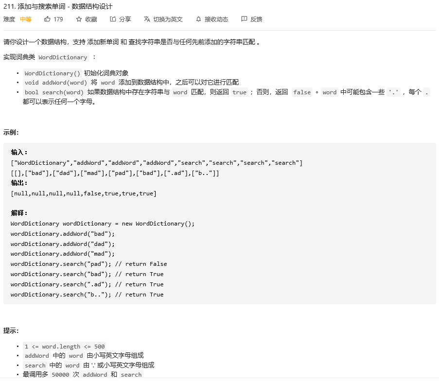

### leetcode_211_medium_添加与搜索单词-数据结构设计



本题考察点为Trie树

查找单词是否出现过，可以想到用数据结构**set<string>**，但是存在问题，因为有'.'代表的，不确定字母

- 暴力法，遍历set  判断与当前word是否匹配，相当于没有任何优化
- 分别将当前word中的每个'.'，替换为全部26个字母，放入set中查找。单次查找的时间复杂度为O(26^m*logn)。其中，O(26^m)代表分别尝试替换每一个'.'，m为'.'的数量。O(logn)为 从set中查询该单词的时间复杂度


如果用Trie树，则可以很大程度上优化时间复杂度。例如，将第一个'.'替换为某个字母后，发现下一个字母无法匹配，则可剪枝，不再进行后续匹配。

```c++
class WordDictionary {
public:
	/** Initialize your data structure here. */
	WordDictionary() {
		m_bIsEnd = false;
		m_child = vector<WordDictionary*>(26);
	}

	/** Adds a word into the data structure. */
	void addWord(string word) {
		WordDictionary* pCur = this;
		for (char c : word)
		{
			if (pCur->m_child[c - 'a'] == nullptr)
				pCur->m_child[c - 'a'] = new WordDictionary();
			pCur = pCur->m_child[c - 'a'];
		}
		pCur->m_bIsEnd = true;
	}

	/** Returns if the word is in the data structure. A word could contain the dot character '.' to represent any one letter. */
	bool search(string word) {
		int index;
		char letter;
		WordDictionary* pCur = this;

		if (word.empty())
			return pCur->m_bIsEnd;
		for (index = 0; index < word.size(); index++)
		{
			letter = word[index];
			if (letter == '.')
			{
				for (int j = 0; j < 26; j++)
				{
					if (pCur->m_child[j] != nullptr && pCur->m_child[j]->search(word.substr(index + 1)))  //跳过当前字母 递归地寻找剩余字符串是否匹配
						return true;
				}
				return false;
			}
			else
			{
				if (pCur->m_child[letter - 'a'] == nullptr)
					return false;
				pCur = pCur->m_child[letter - 'a'];
			}
		}
		return pCur->m_bIsEnd;
	}

private:
	bool m_bIsEnd;  //当前节点是否为一个单词的终点
	vector<WordDictionary*> m_child;  //以长度为26的vector 表示26个子节点的26个字母
};

/**
 * Your WordDictionary object will be instantiated and called as such:
 * WordDictionary* obj = new WordDictionary();
 * obj->addWord(word);
 * bool param_2 = obj->search(word);
 */
```

