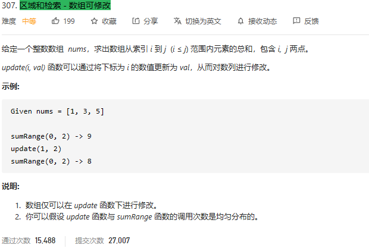

### leetcode_307_medium_区域和检索 - 数组可修改



参照《线段树.md》

```c++
class NumArray {
public:
	NumArray(vector<int>& nums) {
		if (nums.empty())  //数组为空则无法处理
			return;
		m_treeValue = vector<int>(4 * nums.size(), -1);  //初始化 一般线段数组大小为原数组大小长度的4倍
		this->build(nums, 0, 0, nums.size() - 1);
		m_nRightEnd = nums.size() - 1;  //线段树的右端点 即为数组长度-1
	}

	void update(int i, int val) {
		this->update(0, i, 0, m_nRightEnd, val);
	}

	int sumRange(int i, int j) {
		return sumRange(0, 0, m_nRightEnd, i, j);

	}

private:
	void build(vector<int>& nums, int pos, int left, int right)  //递归地构造线段树数组 pos-当前节点在m_treeValue中的下标，begin、end 对应nums[begin,end]区域
	{
		if (left == right)  //正在处理叶节点
			m_treeValue[pos] = nums[left];
		else  //正在处理非叶子节点
		{
			int mid = (left + right) / 2;
			build(nums, pos * 2 + 1, left, mid);  //递归处理左子树
			build(nums, pos * 2 + 2, mid + 1, right);  //递归处理右子树
			m_treeValue[pos] = m_treeValue[pos * 2 + 1] + m_treeValue[pos * 2 + 2];  //更新当前节点数值
		}
	}

	int sumRange(int pos, int left, int right, int qLeft, int qRight)  //递归地计算线段和，left、right对应当前节点的区域[left,right] qLeft、qRight对应待求和的区域[qLeft,qRight]
	{
		if (left > qRight || right < qLeft)  //如果当前节点覆盖区域和查找区域不重合 则返回0
			return 0;
		else if (left >= qLeft && right <= qRight)  //如果当前节点覆盖区域是查找区域的子集，则返回当前节点数值
			return m_treeValue[pos];
		else  //其他情况，向左右子树递归查找
		{
			int mid = (left + right) / 2;
			return sumRange(pos * 2 + 1, left, mid, qLeft, qRight)
				+ sumRange(pos * 2 + 2, mid + 1,right, qLeft, qRight);
		}
	}

	void update(int pos, int index, int left, int right,int newValue)  //递归地更新线段树，更新原数组在index处的数值
	{
		if (left == right && left == index)  //如果访问到叶子节点 且访问到的是index对应的叶子节点
			m_treeValue[pos] = newValue;
		else  //否则 递归地更新左右字数
		{
			int mid = (left + right) / 2;
			if(index<= mid)
				update(pos * 2 + 1, index, left, mid, newValue);
			else
				update(pos * 2 + 2, index, mid + 1, right, newValue);
			m_treeValue[pos] = m_treeValue[pos * 2 + 1] + m_treeValue[pos * 2 + 2];  //更新当前节点数值
		}
	}

private:
	vector<int> m_treeValue;  //线段树，完全二叉树，由数组形式存储
	int m_nRightEnd;  //线段树数组 最右侧元素的下标
};

/**
 * Your NumArray object will be instantiated and called as such:
 * NumArray* obj = new NumArray(nums);
 * obj->update(i,val);
 * int param_2 = obj->sumRange(i,j);
 */
```

