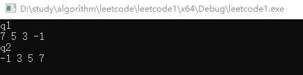

### 优先队列

参考[C++ priority_queue(STL priority_queue)用法详解 (biancheng.net)](http://c.biancheng.net/view/480.html)

std::priority_queue容器定义了一个元素有序排列的队列。本质上是一个堆。

priority_queue 模板有 3 个参数，其中两个有默认的参数；第一个参数是存储对象的**类型**，第二个参数是存储元素的**底层容器**，第三个参数是函数对象，它定义了一个**用来决定元素顺序的断言**。因此模板类型是：

```c++
template <typename T, typename Container=std::vector<T>, typename Compare=std::less<T>> class priority_queue
```

如代码所示，priority_queue 实例默认有一个 vector 容器。函数对象类型 less<T> 是一个默认的排序断言，定义在头文件 function 中，决定了容器中最大的元素会排在队列前面。fonction 中定义了 greater<T>，用来作为模板的最后一个参数对元素排序，最小元素会排在队列前面。当然，如果指定模板的最巵一个参数，就必须提供另外的两个模板类型参数。


#### priority_queue 常用操作

- push(const T& obj)：将obj的副本放到容器的适当位置，这通常会包含一个排序操作，O(logn)

- top()：返回优先级队列中第一个元素的引用，O(1)

- pop()：移除第一个元素，O(logn)

- size()：返回队列中元素的个数，O(1)

- empty()：如果队列为空的话，返回true。O(1)

- 使用迭代器初始化一个优先队列

  ```c++
  std::string wrds[] { "one", "two", "three", "four"};
  std::priority_queue<std::string> words { std::begin(wrds),std:: end(wrds)}; // "two" "three" "one" "four" 
  ```

#### 使用示例

```c++
//默认排序断言是less<T>，即大顶堆
	priority_queue<int> q1(nums.begin(),nums.end());
	cout << "q1" << endl;
	while (!q1.empty())
	{
		cout << q1.top()<<" ";
		q1.pop();
	}
	cout << endl;
	//如果需要小顶堆，则需手动指定模板的全部三个参数
	priority_queue<int, vector<int>, greater<int>> q2(nums.begin(), nums.end());
	cout << "q2" << endl;
	while (!q2.empty())
	{
		cout << q2.top()<<" ";
		q2.pop();
	}
```



