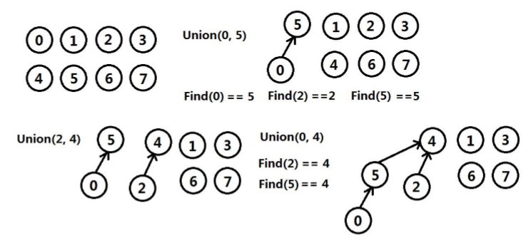
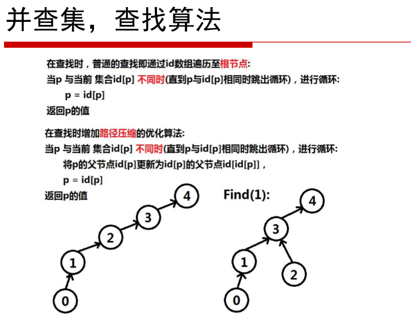
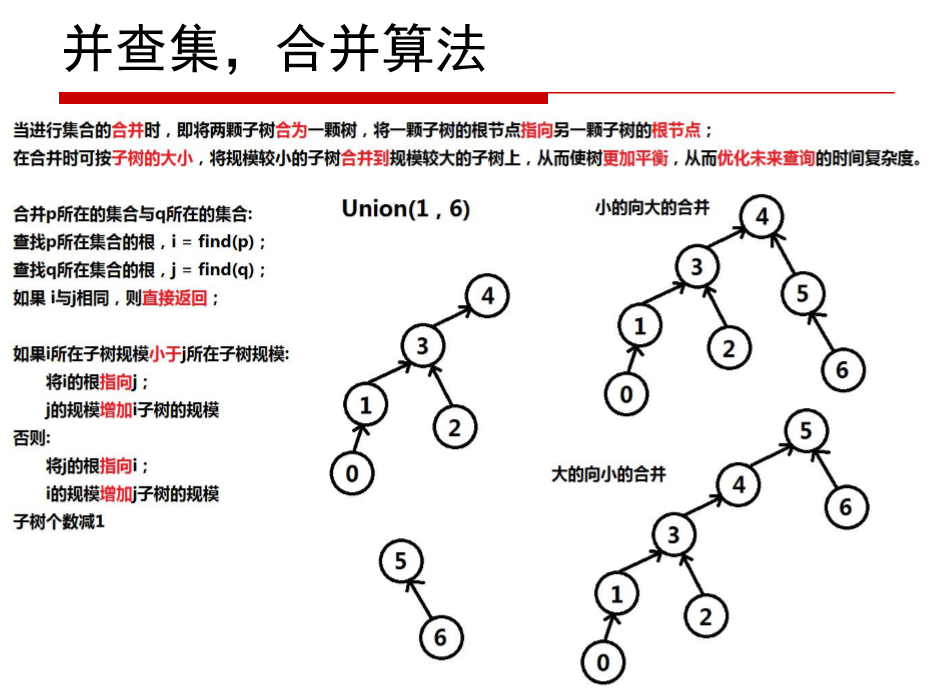

### 并查集

**并查集**(Union Find)，又称**不相交集合**(DIsjiont Set)，它应用于N个元素的集合**求并**与**查询**问题。通常是在开始时，让每个元素构成一个**单元素**的集合，然后按**一定顺序**将属于**同一组**的元素所在的集合**合并**，期间要**反复查找**一个元素在哪个集合中。虽然问题并不复杂，但是在面对**极大的数据量**时，普通的数据结构往往无法解决，并查集就是解决该种问题的优秀算法。


#### 数组实现

用数组纪录每个元素所属的集合。查找find的时间复杂度O(1)，合并union的时间复杂度O(n)。对于较多合并操作的情况太慢

```c++
class DisjointSet {
public:
	DisjointSet(int size)
	{
		for (int i = 0; i < size; i++)
			m_id.push_back(i);
	}

	int find(int elem)  //查询元素属于哪个集合 O(1)
	{
		return m_id[elem];
	}

	void unionSets(int elem1, int elem2)  //合并两个元素所属的集合 O(n)
	{
		if (m_id[elem1] != m_id[elem2])
		{
			for (int i = 0; i < m_id.size(); i++)
			{
				if (m_id[i] == m_id[elem2])
					m_id[i] = m_id[elem1];
			}
		}
	}

private:
	vector<int> m_id;  //指示当前元素属于的集合序号
};
```

#### 森林实现

使用**森林**存储集合间的关系。属于**同一集合**的不同元素，都有一个**相同的根节点**，代表这个集合。

**查找**元素数属于哪个集合时，遍历元素到根节点，返回根节点所代表的集合。 在遍历过程中采用**路径压缩**的优化算法，使整体树的形状更加扁平，从而优化**查询**的时间复杂度。

当进行合并时，即将两棵子树**合并**为一棵树，将一棵子树的根节点指向另一棵子树的根节点。合并时可以按照子树的大小，将**规模较小**的子树**合并**到**规模较大**的子树上，从而使树规模更加平衡，从而优化未来**查询**的时间复杂度。







```c++
class DisjointSet {
public:
	DisjointSet(int size)
	{
		for (int i = 0; i < size; i++)
		{
			m_id.push_back(i);
			m_size.push_back(1);
			m_nCount = size;
		}
	}

	int count() { return m_nCount; }

	int find(int elem)  //查询元素属于哪个集合 O(1)
	{
		while (elem!=m_id[elem])
		{
			m_id[elem] = m_id[m_id[elem]];  //压缩树
			elem = m_id[elem];
		}
		return elem;
	}

	void unionSets(int elem1, int elem2)  //合并两个元素所属的集合 O(n)
	{
		int root1, root2;
		root1 = this->find(elem1);
		root2 = this->find(elem2);
		if (root1 == root2)
			return;
		//将小树合并到大树上
		if (m_size[elem1] <= m_size[elem2])
		{
			m_id[root1] = root2;
			m_size[root2] += m_size[root1];
		}
		else
		{
			m_id[root2] = root1;
			m_size[root1] += m_size[root2];
		}
		m_nCount--;
	}

private:
	vector<int> m_id;  //指示当前元素属于的集合序号
	vector<int> m_size;  //指示以当前元素为根节点的树，其总的元素个数
	int m_nCount;  //当前集合数量
};

```

