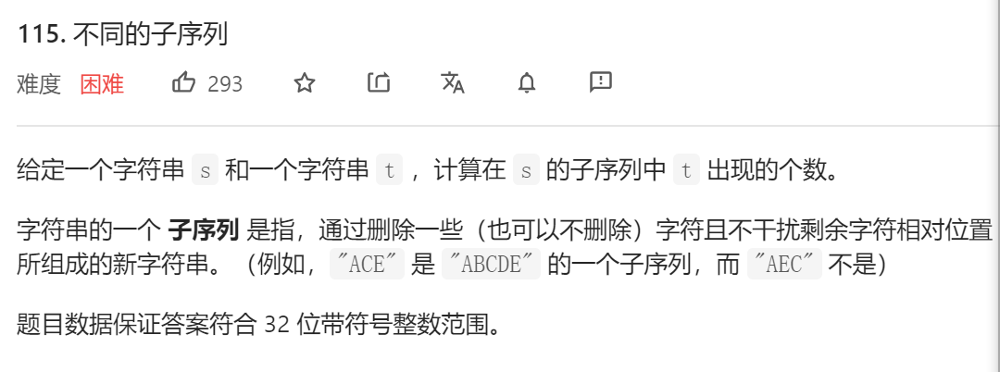
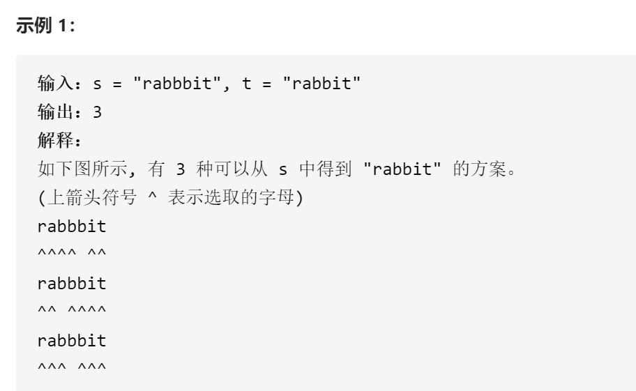
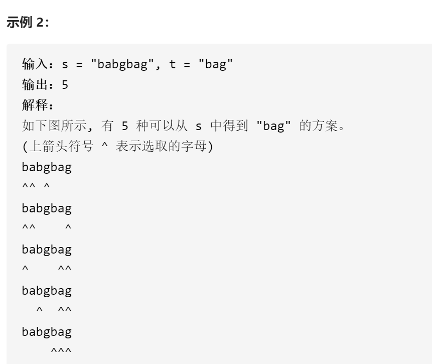
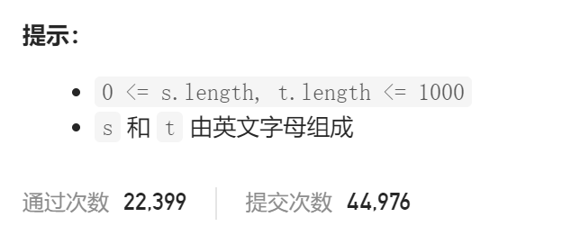

### leetcode_115_hard_不同的子序列









```c++
class Solution {
public:
    int numDistinct(string s, string t) {

    }
};
```

#### 算法思路

使用**dp算法**，构造数组matchNum[m] [n]，代表s的[0,m]区间的字符，与t的[0,n]区间的字符，子序列匹配的数量。

讨论状态转移方程 matchNum[i] [j]

- 首行，首列 单独讨论
- 如果s[i]!=t[j]，则s[i]这个字符不能用于这组子序列匹配。matchNum[i] [j]=matchNum[i-1] [j]
- 如果s[i]==t[j] 则s[i]这个字符可以用于这组子序列匹配
  - 对于s[i]用于子序列匹配的情况，matchNum[i] [j]+=matchNum[i-1] [j-1]
  - 对于s[i]不用于子序列匹配的情况，matchNum[i] [j]+=matchNum[i-1] [j]

另外，本题虽然答案复合int取值范围，但是中间过程会涉及long范围的数据

> 执行出错信息：
>
> Line 24: Char 21: runtime error: signed integer overflow: 1474397256 + 891953512 cannot be represented in type 'int' (solution.cpp)
>
> 最后执行的输入：
>
> "xslledayhxhadmctrliaxqpokyezcfhzaskeykchkmhpyjipxtsuljkwkovmvelvwxzwieeuqnjozrfwmzsylcwvsthnxujvrkszqwtglewkycikdaiocglwzukwovsghkhyidevhbgffoqkpabthmqihcfxxzdejletqjoxmwftlxfcxgxgvpperwbqvhxgsbbkmphyomtbjzdjhcrcsggleiczpbfjcgtpycpmrjnckslrwduqlccqmgrdhxolfjafmsrfdghnatexyanldrdpxvvgujsztuffoymrfteholgonuaqndinadtumnuhkboyzaqguwqijwxxszngextfcozpetyownmyneehdwqmtpjloztswmzzdzqhuoxrblppqvyvsqhnhryvqsqogpnlqfulurexdtovqpqkfxxnqykgscxaskmksivoazlducanrqxynxlgvwonalpsyddqmaemcrrwvrjmjjnygyebwtqxehrclwsxzylbqexnxjcgspeynlbmetlkacnnbhmaizbadynajpibepbuacggxrqavfnwpcwxbzxfymhjcslghmajrirqzjqxpgtgisfjreqrqabssobbadmtmdknmakdigjqyqcruujlwmfoagrckdwyiglviyyrekjealvvigiesnvuumxgsveadrxlpwetioxibtdjblowblqvzpbrmhupyrdophjxvhgzclidzybajuxllacyhyphssvhcffxonysahvzhzbttyeeyiefhunbokiqrpqfcoxdxvefugapeevdoakxwzykmhbdytjbhigffkmbqmqxsoaiomgmmgwapzdosorcxxhejvgajyzdmzlcntqbapbpofdjtulstuzdrffafedufqwsknumcxbschdybosxkrabyfdejgyozwillcxpcaiehlelczioskqtptzaczobvyojdlyflilvwqgyrqmjaeepydrcchfyftjighntqzoo" "rwmimatmhydhbujebqehjprrwfkoebcxxqfktayaaeheys"

```c++
class Solution {
public:
	int numDistinct(string s, string t) {
		int i, j;
		vector<vector<long>> matchNum(s.size(), vector<long>(t.size(), 0));  //s的前i个字符，与t的前j个字符，子序列的数量
		if (s.empty() || t.empty())
			return 0;
		//首行
		if (s[0] == t[0])
			matchNum[0][0] = 1;
		//其余各行
		for (i = 1; i < s.size(); i++)
		{
			//首列
			matchNum[i][0] = s[i] == t[0] ? matchNum[i-1][0] + 1 : matchNum[i - 1][0];
			//其余各列
			for (j = 1; j < t.size(); j++)
			{
				if (s[i] != t[j])
					matchNum[i][j] = matchNum[i - 1][j];
				else
				{
					matchNum[i][j] += matchNum[i - 1][j - 1];  //使用s[i]作为子序列的最后一个字符
					matchNum[i][j] += matchNum[i - 1][j];  //不使用s[i]作为子序列的最后一个字符
				}
			}
		}
		return matchNum[s.size() - 1][t.size() - 1];
	}
};
```

