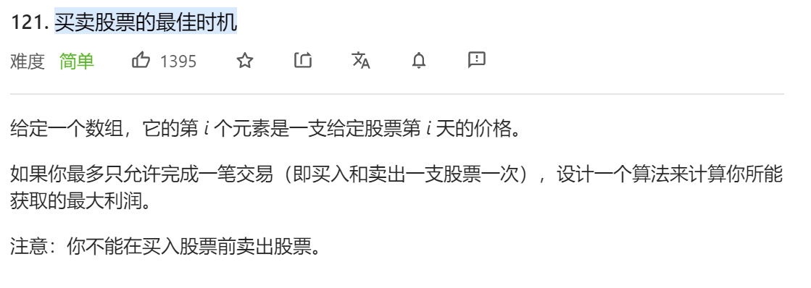
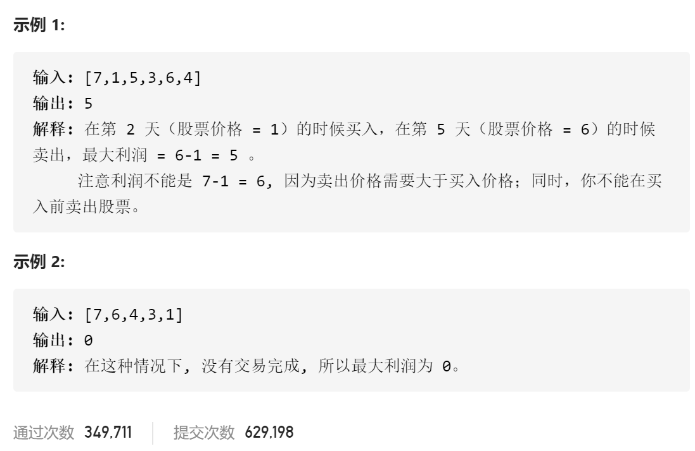

### leetcode_121_easy_买卖股票的最佳时机





```c++
class Solution {
public:
    int maxProfit(vector<int>& prices) {

    }
};
```

#### 算法思路

扫描每一个价格。计算 以史低价买入，当前价格售出 所能得到的收益。

```c++
class Solution {
public:
	int maxProfit(vector<int>& prices) {
		int i,minPrice, result;

		if (prices.empty())
			return 0;
		minPrice = prices[0];  //史低价
		result = 0;
		for (i = 1; i < prices.size(); i++)
		{
			result = max(result, prices[i] - minPrice);
			minPrice = min(minPrice, prices[i]);
		}
		return result;
	}
};
```

