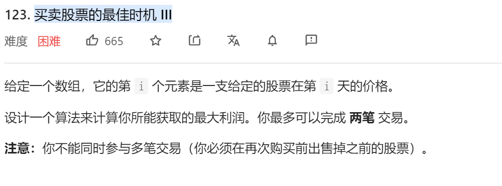
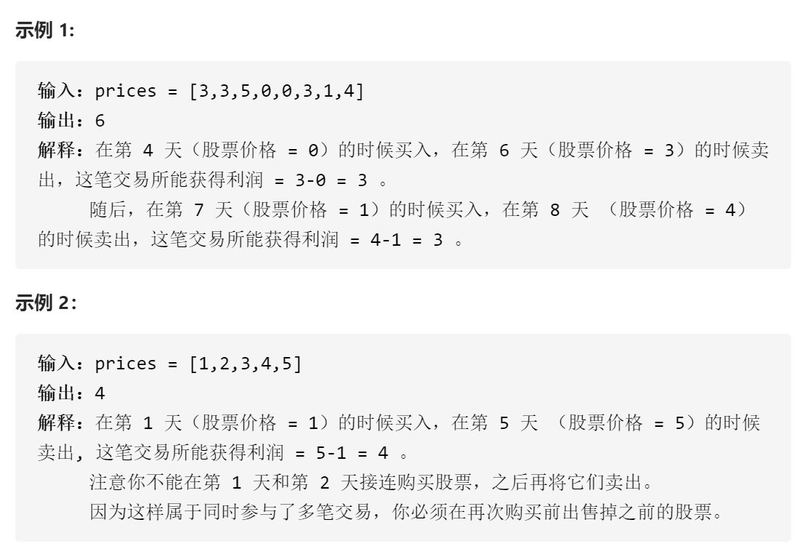
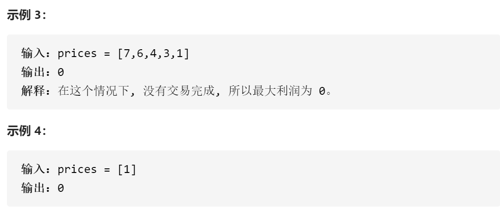
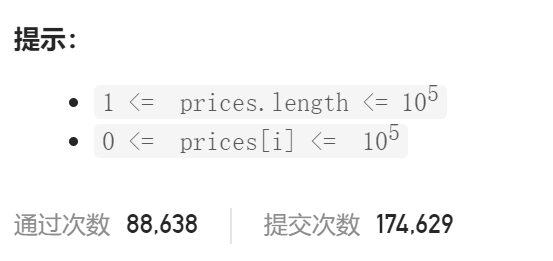

### leetcode_123_hard_[买卖股票的最佳时机 III









#### 拆分为两次交易

这题类似leetcode_121_easy_买卖股票的最佳时机。只不过，121仅允许一次交易，而本题允许两次交易。

因此考虑用动态规划的思路解决。将交易拆分为两部分，前n天进行一次交易，第n天以后进行一次交易，从而保证这两次交易不重合

dpFirstHalf[n]，表示发生在前n天的交易，能获得的收入最大值。即，买入操作发生的日期data<=n，卖出操作发生的日期data<=n

dpSecondHalf[n]，表示发生在第n天以后的交易，能获得的收入最大值。即，买入操作发生的日期data>=n，卖出操作发生的日期data>=n

```c++
class Solution {
public:
	int maxProfit(vector<int>& prices) {
		int i,minPrice, maxPrice, maxProfit;
		vector<int> dpFirstHalf(prices.size(),0);  //发生在前n天的交易，能获得的收入最大值
		vector<int> dpSecondHalf(prices.size(),0);  //发生在第n天以后的交易，能获得的收入最大值

		if (prices.empty())
			return 0;
		//第一次扫描，求前n天的收入最大值
		for (i = 1, minPrice = prices[0]; i < prices.size(); i++)
		{
			dpFirstHalf[i] = max(dpFirstHalf[i - 1], prices[i] - minPrice);  //计算以史低价买入，当前价售出
			minPrice = min(minPrice, prices[i]);
		}
		//第二次扫描，求第n天后的收入最大值
		for (i = prices.size() - 2, maxPrice = prices[prices.size() - 1]; i >= 0; i--)
		{
			dpSecondHalf[i] = max(dpSecondHalf[i + 1], maxPrice - prices[i]);  //计算以当前价买入，历史最高价售出
			maxPrice = max(maxPrice, prices[i]);
		}
		//第三次扫描，求总的收入最大值
		for (i = 0, maxProfit = 0; i < prices.size(); i++)
			maxProfit = max(maxProfit, dpFirstHalf[i] + dpSecondHalf[i]);
		return maxProfit;
	}
};
```

#### 维护当前交易状态

任意某天结束后，总处于以下五种状态之一

- 未进行任何操作
- 进行了一次买操作 buy1
- 完成了一笔交易(一次买+一次卖) sell1
- 进行了第二次买操作(两次买+一次卖) buy2
- 完成了两笔交易(两次买+两次卖) sell2

以上的状态量，维护的是，如果今日结束后，是当前的买/卖状态，那么，目前可以达到的最大营收是什么样的

状态转移方程见代码

```c++
class Solution {
public:
	int maxProfit(vector<int>& prices) {
		int i,buy1, sell1, buy2, sell2;

		buy1 = -prices[0];
		sell1 = 0;
		buy2 = -prices[0]; //认为，在第0天进行了买入-卖出-买入
		sell2 = 0;  //认为 在第0天进行了买入-卖出-买入-卖出
		for (i = 0; i < prices.size(); i++)
		{
			buy1 = max(buy1, -prices[i]);  //第一次购买的方案。可以延续前一天的购买方案；也可以转为以今日股价购买
			sell1 = max(sell1, buy1 + prices[i]);  //第一次出售的方案。可以延续前一天的出售方案；也可以转为以今日股价出售
			buy2 = max(buy2, sell1 - prices[i]);  //最后一次购买的方案。可以采取前一天的购买方案；也可以采取，在今日之前进行第一次出售，并在今日进行买入
			sell2 = max(sell2, buy2 + prices[i]);  //最后一次出售的方案。可以采取前一天的出售方案；也可以转为以今日股价出售
		}
		return sell2;
	}
};
```

