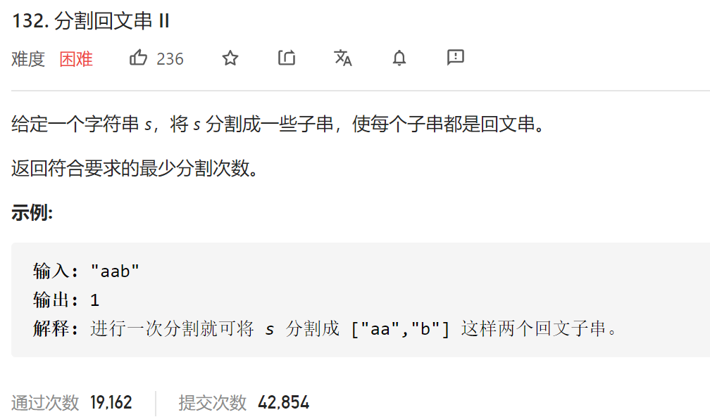

### leetcode_132_hard_分割回文串



```c++
class Solution {
public:
    int minCut(string s) {

    }
};
```

#### 算法思路

和 leetcode_131_medium_分割回文串 类似。

##### 判断回文串

可以构造二维数组isPalindrome[] []，表示字符串s的[i,j]区间 是否形成回文串

分别讨论以s的每一个字符s[i]作为中心元素，扩展回文串，这又分为两种情况

- 以s[i]为正中心的 长度为奇数的回文串
- 以s[i]为中心偏左元素的  长度为偶数的回文串

##### 动态规划

以cutNum[i]记录 下标在[0,i]区间的元素 需要多少次分割，则状态转移方程可以描述为，cutNum[i]  min(dp[k]+1) 其中k<i，且[k+1,i]区间为回文串。  也就是 在dp[k]对应的分割上，再加上一个回文串

- 如果[0,i]是回文串，则cutNum[i]=0
- 如果[0,i]不是回文串，则需要在之前的某次[0,j]区间的分割的基础上，再添加一个回文串[j+1,i]

```c++
class Solution {
public:
	int minCut(string s) {
		int size=s.size(), i,j, l, r;
		vector<int> cutNum(size,INT_MAX);  //下标为[0,n]区间的子串 需要几次分割
		vector<vector<bool>> isPalindrome(size, vector<bool>(size, false));

		//统计有哪些回文串
		for (i = 0; i < size; i++)
		{
			//长度为奇数的字符串
			for (l = i, r = i; l >= 0 && r < size &&s[l] == s[r]; l--, r++)
				isPalindrome[l][r] = true;
			//长度为偶数的字符串
			for (l = i, r = i + 1; l >= 0 && r < size &&s[l] == s[r]; l--, r++)
				isPalindrome[l][r] = true;
		}
		//dp统计回文串分割数
		for (i = 0; i < size; i++)
		{
			if (isPalindrome[0][i])
			{
				cutNum[i] = 0;
				continue;
			}
			for (j = 0; j < i; j++)
			{
				if (isPalindrome[j + 1][i])  //下标为[0,j]区间的子串使用一种分割，[j+1,i]区间的 是回文串 无需分割
					cutNum[i] = min(cutNum[i], cutNum[j] + 1);
			}
		}
		return cutNum[size-1];
	}
};
```

