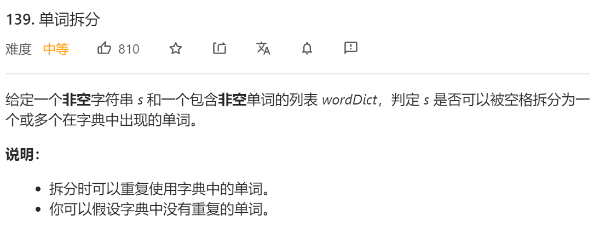
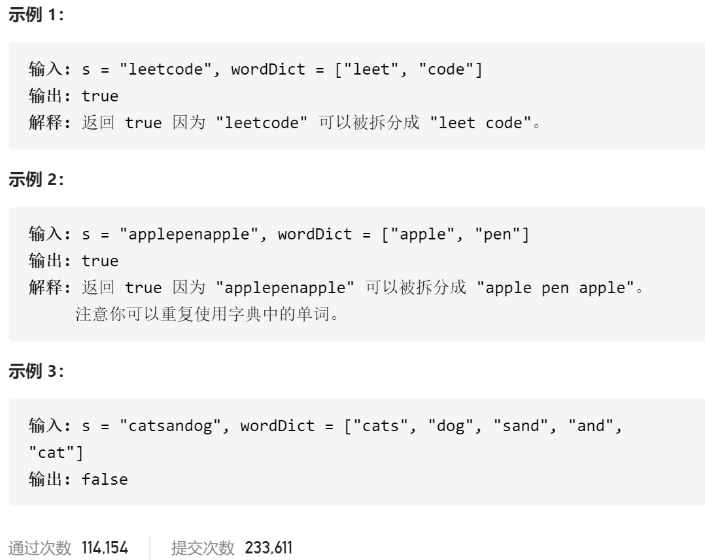

### leetcode_139_medium_单词拆分





```c++
class Solution {
public:
    bool wordBreak(string s, vector<string>& wordDict) {

    }
};
```

#### 算法思路

构造数组dp[i]，记录s的前i个字符的子串，是否可以以字典中的单词组合而成

 状态转移方程见代码

```c++
class Solution {
public:
	bool wordBreak(string s, vector<string>& wordDict) {
		int i,j,maxLength,dictSize=wordDict.size();
		set<string> words;  //字典
		vector<bool> dp(s.size(),false);  //s的前i个字符的子串，是否可以以字典中的单词组合而成

		//统计字典
		for (i = 0,maxLength=0; i < dictSize; i++)
		{
			words.insert(wordDict[i]);
			maxLength = max(maxLength, int(wordDict[i].size()));  //统计字典单词的最大长度
		}
		//构造状态数组
		for (i = 0; i < s.size(); i++)  //讨论dp[i]
		{
			if (words.find(s.substr(0, i + 1)) != words.end())  //讨论前i个字符是否为单词
			{
				dp[i] = true;
				continue;
			}
			for (j = max(i - maxLength, 0); j < i; j++)  //讨论能否由dp[j]，以及下标为[j+1,i]的字符串组合而成
			{
				if (dp[j]
					&& words.find(s.substr(j + 1, i - j)) != words.end())
				{
					dp[i] = true;
					break;
				}
			}
		}

		return dp[s.size()-1];
	}
};
```

