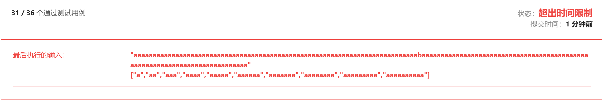
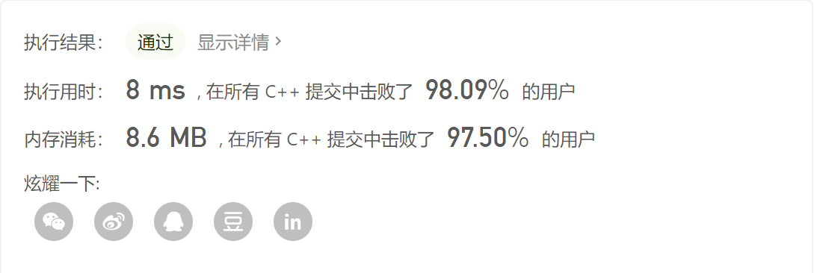

### leetcode_140_hard_单词拆分 Ⅱ


```c++
class Solution {
public:
    vector<string> wordBreak(string s, vector<string>& wordDict) {

    }
};
```

#### 动态规划(超时)

类似 leetcode_139_medium_单词拆分 构造状态数组 vector<vector<string>> dp。 s的前i个字符，能够形成的所有字符串可能性

```c++
class Solution {
public:
	vector<string> wordBreak(string s, vector<string>& wordDict) {
		int i, j, k, maxLength;
		string substring;
		set<string> words;  //词典里的所有单词
		vector<vector<string>> dp(s.size());  //s的前i个字符，能够形成的所有字符串可能性

		//记录词典中的单词
		for (i = 0, maxLength = 0; i < wordDict.size(); i++)
		{
			words.insert(wordDict[i]);
			maxLength = max(maxLength, int(wordDict[i].size()));  //统计词典里单词的最大长度
		}
		//动态规划 统计前i个字符能够形成的字符串
		for (i = 0; i < s.size(); i++)
		{
			//前i个字符作为一整个单词的情况
			substring = s.substr(0, i + 1);
			if (words.count(substring))
				dp[i].push_back(substring);
			//在dp[j]的基础上，下标为[j+1,i]区间的字母形成一个单词
			for (j = max(0, i - maxLength); j < i; j++)
			{
				substring = s.substr(j + 1, i - j);
				if (dp[j].empty() || words.count(substring) == 0)
					continue;
				for (k = 0; k < dp[j].size(); k++)
					dp[i].push_back(dp[j][k] + " " + substring);
			}
		}
		return dp[s.size() - 1];
	}
};
```

该算法超时



#### 改进的动态规划

对于上述超时的测试用例，其核心问题是，对于一个无解的问题动态规划消耗了过多时间。

那么，使用 leetcode_139_medium_单词拆分 的方法，先判断问题是否有解。

```c++
class Solution {
public:
	vector<string> wordBreak(string s, vector<string>& wordDict) {
		int i, j, k, maxLength;
		string substring;
		set<string> words;  //词典里的所有单词
		vector<bool> valid(s.size(),false);  //判断s的前i个字符，能否形成至少一种单词分割
		vector<vector<string>> dp(s.size());  //s的前i个字符，能够形成的所有字符串可能性

		//记录词典中的单词
		for (i = 0, maxLength = 0; i < wordDict.size(); i++)
		{
			words.insert(wordDict[i]);
			maxLength = max(maxLength, int(wordDict[i].size()));  //统计词典里单词的最大长度
		}
		//动态规划，判断前i个字符，能否形成至少一种单词分割
		for (i = 0; i < s.size(); i++)
		{
			if (words.count(s.substr(0, i + 1)))
			{
				valid[i] = true;
				continue;
			}
			for (j = max(0, i - maxLength); j < i; j++)
				if (valid[j] && words.count(s.substr(j + 1, i - j)))
				{
					valid[i] = true;
					continue;
				}
		}
		if (!valid[s.size() - 1])
			return {};
		//动态规划 统计前i个字符能够形成的字符串
		for (i = 0; i < s.size(); i++)
		{
			//前i个字符作为一整个单词的情况
			substring = s.substr(0, i + 1);
			if (words.count(substring))
				dp[i].push_back(substring);
			//在dp[j]的基础上，下标为[j+1,i]区间的字母形成一个单词
			for (j = max(0, i - maxLength); j < i; j++)
			{
				substring = s.substr(j + 1, i - j);
				if (dp[j].empty() || words.count(substring) == 0)
					continue;
				for (k = 0; k < dp[j].size(); k++)
					dp[i].push_back(dp[j][k] + " " + substring);
			}
		}
		return dp[s.size() - 1];
	}
};
```



