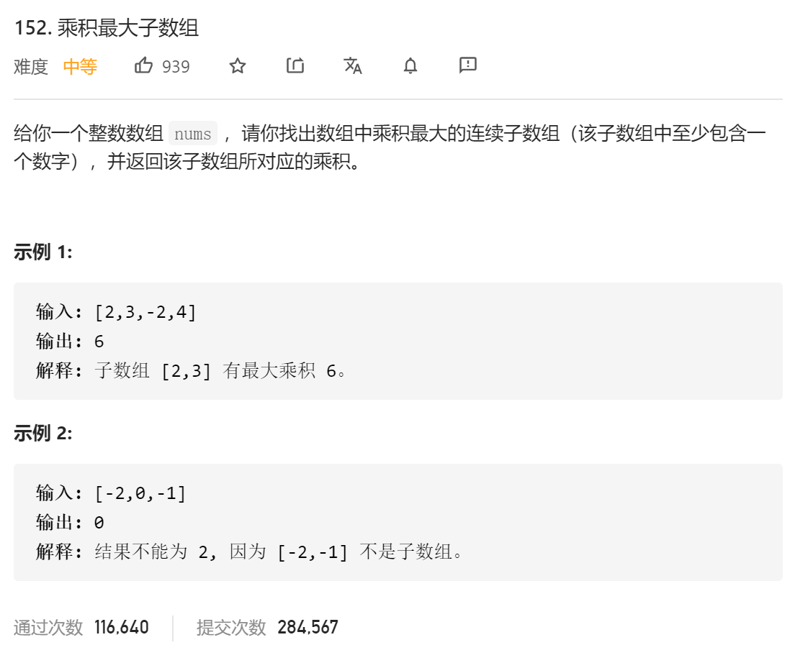

### leetcode_152_medium_乘积最大子数组



```c++
class Solution {
public:
    int maxProduct(vector<int>& nums) {

    }
};
```

#### dp算法

**dp算法**。当讨论到第i个元素时，需讨论以nums[i]为最后一个数字的乘积最大子数组。对于nums[i]<0的情况，对应的乘积最大子数组，应该为i-1及以前的元素和小于0的情况。

因此，构造两个dp数组。

- dpMax，记录以nums[i]为最后一个元素的乘积最大子数组，一般为正值
- dpMin，记录以nums[i]为最后一个元素的乘积最小子数组，一般为负值

```c++
class Solution {
public:
	int maxProduct(vector<int>& nums) {
		int i,result;
		vector<int> dpMax(nums.size());  //以nums[i]为最后一个元素的乘积最大子数组，一般为正值
		vector<int> dpMin(nums.size());  //以nums[i]为最后一个元素的乘积最小子数组，一般为负值

		result = nums[0];
		dpMax[0] = nums[0];
		dpMin[0] = nums[0];
		for (i = 1; i < nums.size(); i++)
		{
			if (nums[i] > 0)
			{
				dpMax[i] = dpMax[i - 1] > 0 ? dpMax[i - 1] * nums[i] : nums[i];
				dpMin[i] = dpMin[i - 1] <= 0 ? dpMin[i - 1] * nums[i] : nums[i];
			}
			else if (nums[i] < 0)
			{
				dpMax[i] = dpMin[i - 1] <= 0 ? dpMin[i - 1] * nums[i] : nums[i];
				dpMin[i] = dpMax[i - 1] > 0 ? dpMax[i - 1] * nums[i] : nums[i];
			}
			else
			{
				dpMax[i] = 0;
				dpMin[i] = 0;
			}
			result = max(result, dpMax[i]);
		}
		return result;
	}
};
```

#### 改进的dp算法

对于上述dp算法，以更简单的思路。当讨论dpMax[i]时，这个值只有可能通过三种方法计算而来。

- dpMax[i]*nums[i]
- dpMin[i] * nums[i]
- nums[i]

取其中最大值即可

讨论dpMin[i]同理

```c++
class Solution {
public:
	int maxProduct(vector<int>& nums) {
		int i,result;
		vector<int> dpMax(nums.size());  //以nums[i]为最后一个元素的乘积最大子数组，一般为正值
		vector<int> dpMin(nums.size());  //以nums[i]为最后一个元素的乘积最小子数组，一般为负值

		result = nums[0];
		dpMax[0] = nums[0];
		dpMin[0] = nums[0];
		for (i = 1; i < nums.size(); i++)
		{
			dpMax[i] = max(dpMax[i-1] * nums[i], max(dpMin[i-1] * nums[i], nums[i]));
			dpMin[i] = min(dpMax[i-1] * nums[i], min(dpMin[i-1] * nums[i], nums[i]));
			result = max(result, dpMax[i]);
		}
		return result;
	}
};
```

