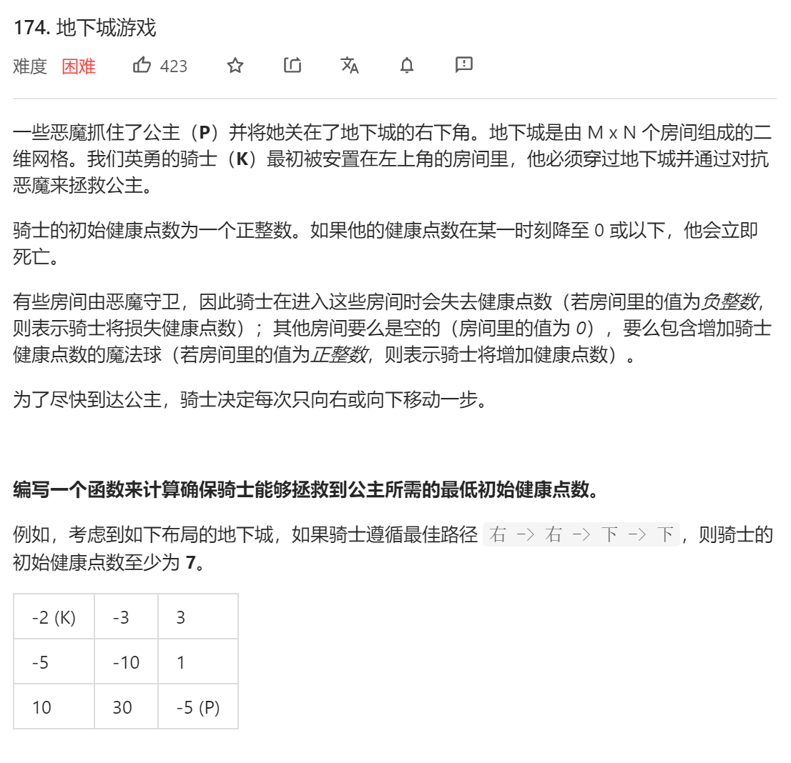

### leetcode_174_hard_地下城游戏




```c++
class Solution {
public:
    int calculateMinimumHP(vector<vector<int>>& dungeon) {

    }
};
```

#### 算法思路

常规思路，使用动态规划算法，计算骑士到达各个格子，在最优情况下可以剩余多少健康点数。但是 问题在于，骑士的初始生命值是不确定的，而全程生命值不能降到0。也就是说，形如-999、+9999的一条路径，尽管能够带来更大的生命值提升，但是对骑士的初始血量要求太高，并不是最优路径

因此，考虑从左下到右上的递归，考虑到达各个位置时，骑士至少要有多少血量，才能最后见到公主

```c++
class Solution {
public:
	int calculateMinimumHP(vector<vector<int>>& dungeon) {
		int y, x, height = dungeon.size(), width = dungeon[0].size(), healthRequired;
		vector<vector<int>> healthNeed(height,vector<int>(width));  //为了保证能见到公主，骑士进入该点前需要多少血量

		for (y = height - 1; y >= 0; y--)
		{
			for (x = width - 1; x >= 0; x--)
			{
				if (y == height - 1 && x == width - 1)
					healthNeed[y][x] = dungeon[y][x] <= 0 ? 1 - dungeon[y][x] : 1;
				else if (y == height - 1)
					healthNeed[y][x] = max(healthNeed[y][x + 1] - dungeon[y][x], 1);
				else if (x == width - 1)
					healthNeed[y][x] = max(healthNeed[y + 1][x] - dungeon[y][x], 1);
				else
					healthNeed[y][x] = max(min(healthNeed[y + 1][x], healthNeed[y][x + 1]) - dungeon[y][x], 1);
			}

		}
		return healthNeed[0][0];
	}
};
```

