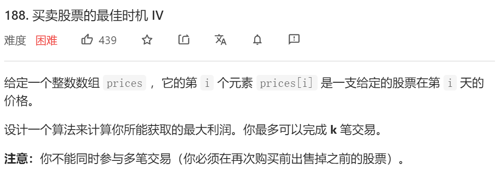
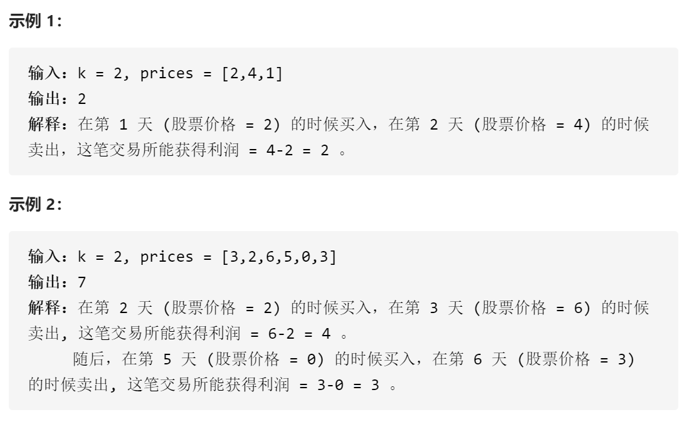
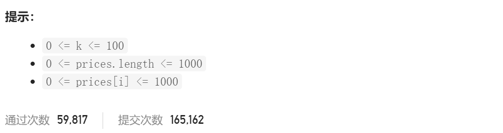

### leetcode_188_hard_买卖股票的最佳时机 Ⅳ







```c++
class Solution {
public:
    int maxProfit(int k, vector<int>& prices) {

    }
};
```

#### 算法思路

使用动态规划算法。buy[i] [j] 表示在第i天完成了前j次买入(不一定在第j天买入)最大收益。sell[i] [j]表示在第i天完成了第j次卖出(不一定在第j天卖出)最大收益。则状态转移方程

buy[i] [j]，比较一下两种买入策略

- buy[i-1] [j]，即延续之前的买入策略
- sell[i] [j-1]-price[i]，即在今天进行买入。

sell[i] [j]，比较以下两种卖出策略

- sell[i-1] [j]，即延续之前的卖出策略
- buy[i] [j]+price[i]，即在今天进行卖出


buy[0] [j]=-price[0]。即在第0天进行完了j-1次买入与j次卖出。

sell[0] [j]=0。即在第0天进行了j次买入与j次卖出

```c++
class Solution {
public:
	int maxProfit(int k, vector<int>& prices) {
		int i,j,profit1,profit2,numDays = prices.size();
		if (numDays == 0 || k == 0)
			return 0;
		vector<vector<int>> buy(numDays, vector<int>(k,-prices[0]));  //第i天完成了前j次买入(不一定在第j天买入)最大收益
		vector<vector<int>> sell(numDays, vector<int>(k, 0));  //第i天完成了第j次卖出(不一定在第j天卖出)最大收益

		for (i = 1; i < numDays; i++)
		{
			for (j = 0; j < k; j++)
			{
				//buy
				profit1 = buy[i - 1][j];  //策略1 延续前一天的买入策略
				profit2 = j > 0 ? sell[i][j - 1] - prices[i] : -prices[i];  //策略2 今日进行买入
				buy[i][j] = max(profit1, profit2);
				//sell
				profit1 = sell[i - 1][j];  //策略1 延续前一天的卖出策略
				profit2 = buy[i][j] + prices[i];  //策略2 今日进行卖出
				sell[i][j] = max(profit1, profit2);
			}
		}
		
		return sell[numDays - 1][k-1];
	}
};
```

