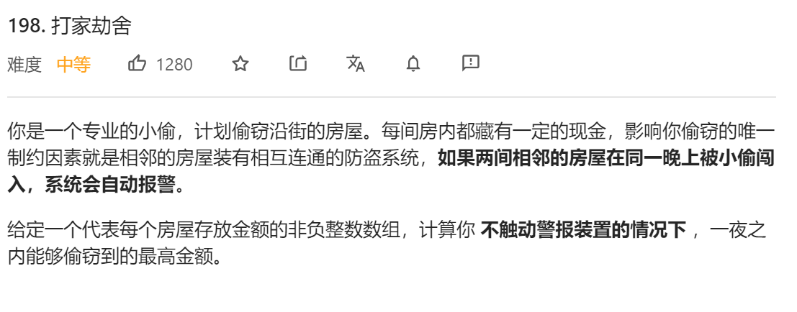
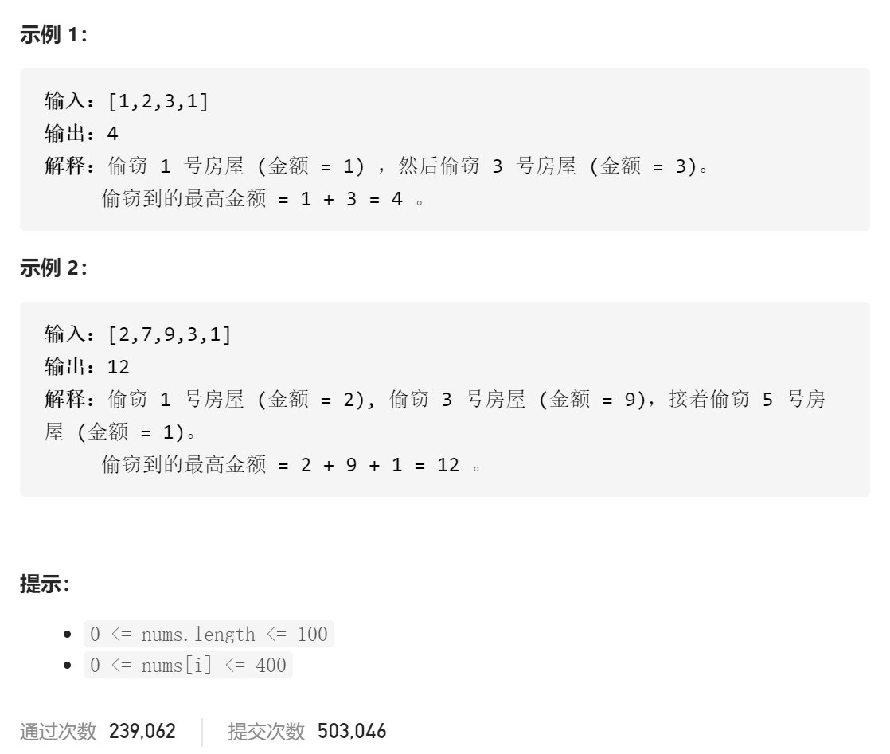

### leetcode_198_medium_打家劫舍





```c++
class Solution {
public:
    int rob(vector<int>& nums) {

    }
};
```

#### 算法思路

构造dp数组profit[i]，记录偷窃前i栋房子的最大收入，则profit[i]=max(profit[i-2]+nums[i]，profit[i-1])

```c++
class Solution {
public:
	int rob(vector<int>& nums) {
		int i;
		vector<int> profit(nums.size());

		if (nums.empty())
			return 0;
		if (nums.size() == 1)
			return nums[0];
		profit[0] = nums[0];
		profit[1] = max(nums[0], nums[1]);
		for (i = 2; i < nums.size(); i++)
			profit[i] = max(profit[i - 2] + nums[i], profit[i - 1]);
		return profit[nums.size() - 1];
	}
};
```

