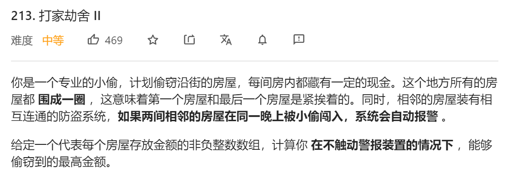
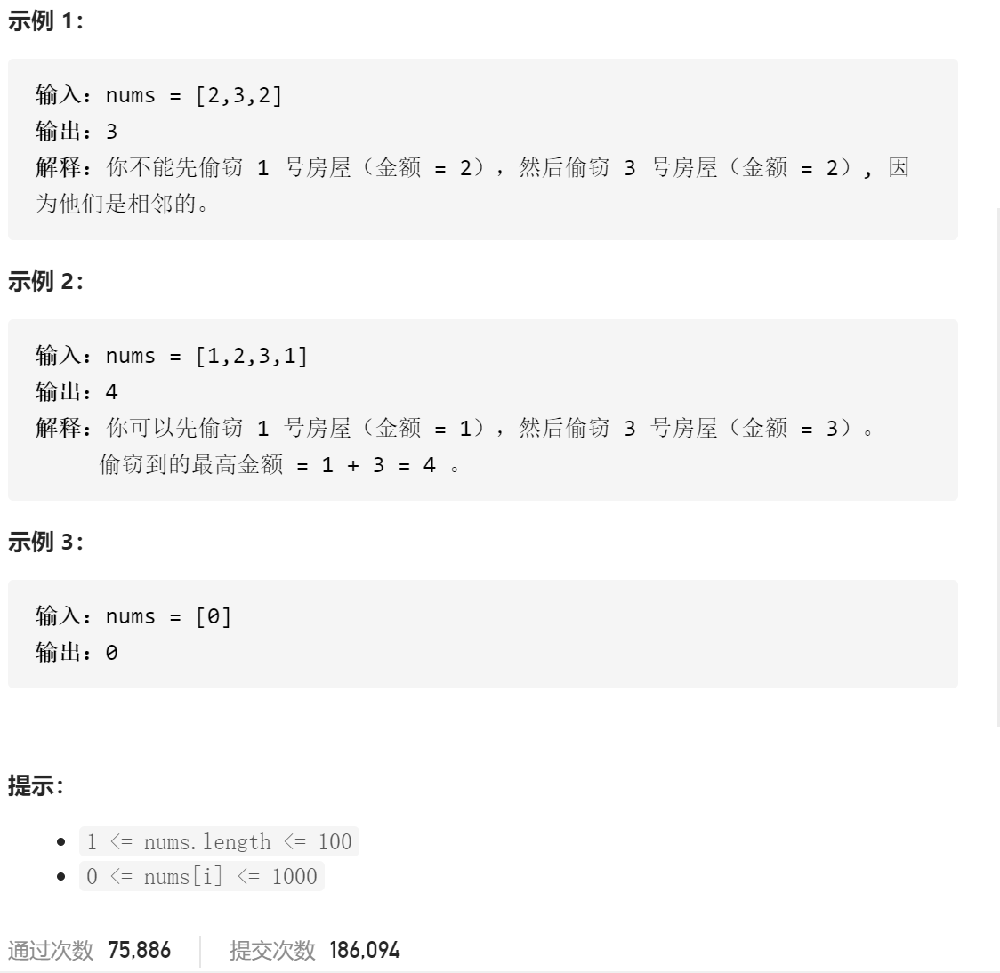

### leetcode_213_medium_打家劫舍Ⅱ





#### 算法思路

在 leetcode_198_medium_打家劫舍 的基础上作简单改动。两次dp。第一次，在允许偷窃第0家的前提下的最大收入。第二次，不允许偷窃第0家的前提下的最大收入

```c++
class Solution {
public:
	int rob(vector<int>& nums) {
		int i;
		vector<int> profit0(nums.size(), 0);  //偷窃前i家 且允许偷窃第0家的前提下 最大收入
		vector<int> profit1(nums.size(), 0);  //偷窃前i家 且不允许偷窃第0家的前提下 最大收入

		if (nums.size() == 1)
			return nums[0];
		if (nums.size() == 2)
			return max(nums[0], nums[1]);
		
		profit0[0] = nums[0];
		profit0[1]= max(nums[0], nums[1]);
		profit1[0] = 0;
		profit1[1] = nums[1];
		for (i = 2; i < nums.size(); i++)
		{
			profit0[i] = max(profit0[i - 2] + nums[i], profit0[i - 1]);  //profit0
			profit1[i] = max(profit1[i - 2] + nums[i], profit1[i - 1]);  //profit1
		}
		return max(profit0[nums.size() - 2], profit1[nums.size() - 1]);
	}
};
```

