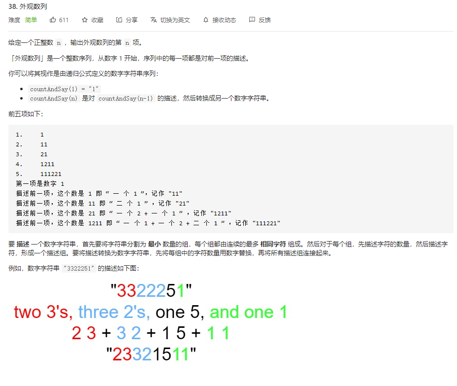
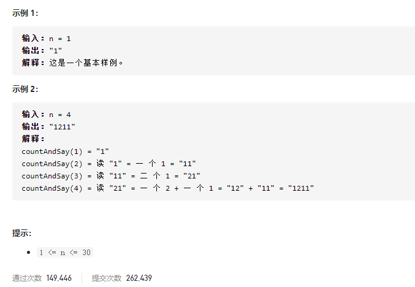

### leetcode_38_easy_外观数列





```c++
class Solution {

public:

  string countAndSay(int n) {


  }

};
```

#### 算法思路

递推求解，知道上一个字符串，即可求得下一个字符串。

递推过程中，需要描述上一个字符串 字符c出现了n次。那么 这n个重复的字符可以用**双指针**来寻找。left指向重复字符的左端点，right指向重复字符的右端点。

注意判断指针越界的条件

```c++
class Solution {
public:
	string countAndSay(int n) {
		int i, left, right;
		string formerStr,curStr;
		vector<string> v;

		v.push_back("1");
		for (i = 1; i < n; i++)
		{
			formerStr = v[i - 1];
			curStr = "";
			left = right = 0;
			while (left < formerStr.size())
			{
				right = left;
				while (right < formerStr.size() - 1 && formerStr[left] == formerStr[right+1])
					right++;
				curStr.push_back(right - left + '1');  //该数字不会大于10 所以可以这样操作
				curStr.push_back(formerStr[left]);  //重复出现的数字
				left = right + 1;
			}
			v.push_back(curStr);
		}
		return v[n - 1];
	}
};
```

