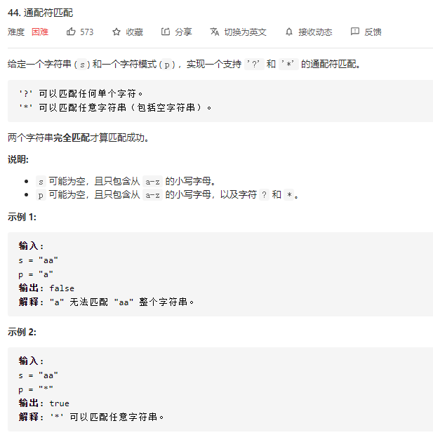
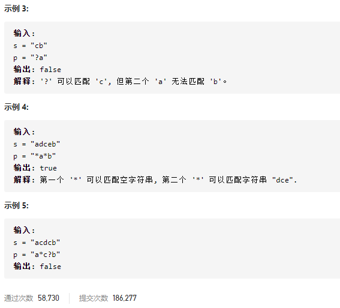

### leetcode_44_hard_通配符匹配





```c++
class Solution {
public:
    bool isMatch(string s, string p) {

    }
};
```

#### dp思路

这题与leetcode_10_hard_正则表达式 非常类似

构造match数组match[i] [j]，代表字符串s的前i个字符，与模板p的前j个字符是否匹配。

##### 增补字符

为了方便讨论，为s、p在字符串头增补一个字符。

则以下讨论的第i个字符，即为原始字符串的第i-1个字符（下标从0开始）

##### 首行

首行，即讨论模板与空字符串是否匹配的问题。

0个和0个字符逻辑上是匹配的。match[0] [0]=true；

所有的模板中，仅有'*'能与空字符串匹配。

对于match[0] [j] j>0

- 如果p[j]=='*'，则可以弃用这个' *'。match[0] [j]=match[0] [j-1]
- 如果p[j]!='*'，则任何其他模板都无法与空字符串匹配，match[0] [j]=false

##### 首列

任意非空字符串，与空模板显然是不匹配的，match[i] [0]=false (i>0的情况)

##### 状态转移方程

方便起见，以下讨论的诸如第i个字符，代表的是从1开始的第i个字符

对于i>0，j>0的情况

- 当match[j]为某个小写字母时
  - 如果s[i]==p[j]，当前字符匹配成功，match[i] [j]=match[i-1] [j-1]
  - 如果s[i]!=p[j]，当前字符匹配失败，match[i] [j]=false
- 当p[j]='?'时，向前匹配一个字符。match[i] [j]=match[i-1] [j-1]
- 当p[j]='*'时，向前匹配0或多个字符。match[i] [j]=match[i-1] [j] || match
  - 如果match[i] [j-1]=true，则*匹配0个字符成功，match[i] [j]=true
  - **如果match[i-1] [j]==true，则*匹配至少一个字符成功**，match[i] [j]=true
  - 其他情况，'*'匹配0个或多个字符都失败了，则match[i] [j]=false

