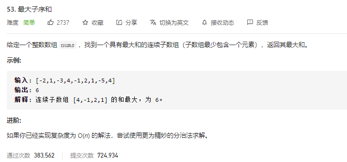

### leetcode_53_easy_最大子序和



```c++
class Solution {
public:
    int maxSubArray(vector<int>& nums) {

    }
};
```

#### dp算法

构造arraySum数组，存储以第n个节点为右端点的，具有最大和的连续子数组

```c++
class Solution {
public:
	int maxSubArray(vector<int>& nums) {
		int i, size = nums.size(), result;
		vector<int> arraySum(nums);  //以n为右节点的连续子数组最大和
		if (nums.empty())
			return 0;
		result = nums[0];
		for (i = 1; i < nums.size(); i++)
		{
			arraySum[i] = arraySum[i - 1] > 0 ? arraySum[i - 1] + nums[i] : nums[i];
			result = max(result, arraySum[i]);
		}
		return result;
	}
};
```

