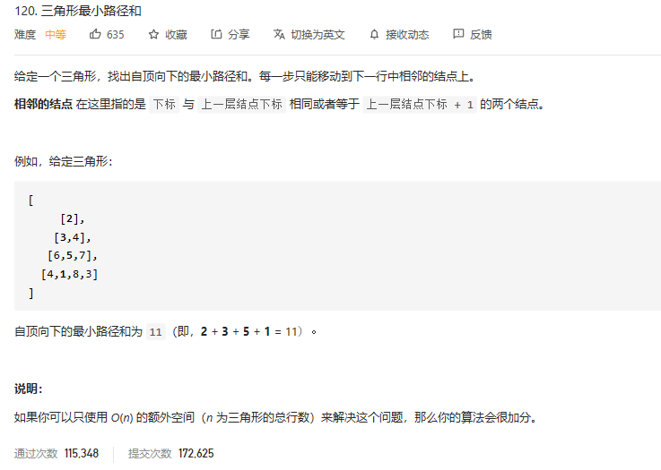

### leetcode_120 三角形



dp算法

对于y>0,x>0的情况
$$
minPath[y][x]=min(minPath[y-1][x-1],minPath[y-1][x])+triangle[y][x]
$$

由于minPath[]的更新可以覆盖在原数组上 所以可以达到o(n)的空间复杂度

```c++
class Solution {
public:
	int minimumTotal(vector<vector<int>>& triangle) {
		if (triangle.empty())
			return 0;
		int y,x,result;
		vector<int> minPath(triangle.size(), INT_MAX);  //当前行 第n个元素的最小路径和

		minPath[0] = triangle[0][0];
		for (y = 1; y < triangle.size(); y++)
		{
			for (x = y; x > 0; x--)
			{
				minPath[x] = min(minPath[x - 1], minPath[x]) + triangle[y][x];
			}
			minPath[0] = minPath[0] + triangle[y][0];
		}
		
		//找到最后一行的最小元素
		result = INT_MAX;
		for (x = 0; x < triangle.size(); x++)
			result = min(result, minPath[x]);
		return result;
	}
};
```

