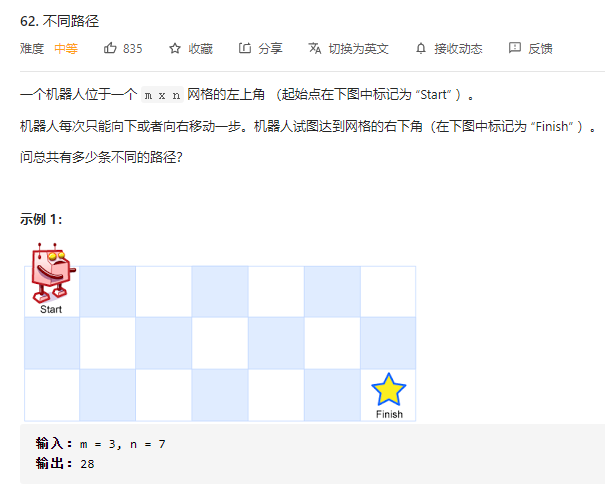
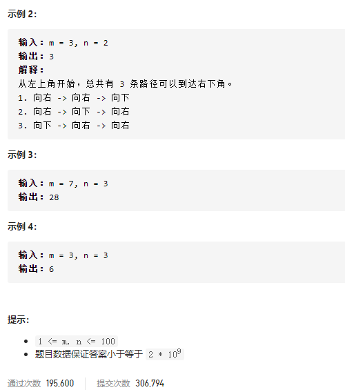
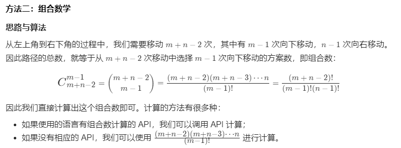

### leetcode_62_medium_不同路径





```c++
class Solution {
public:
    int uniquePaths(int m, int n) {

    }
};
```

#### dp算法

经典dp

注意，**可以仅用一行来记录状态**。dp[x]代表当前行第x列的路径数量。对于y>=1的情况，状态转移方程dp[x]=dp[x-1]+dp[x]。从而将空间复杂度由O(m*n)优化到O(m)。

```c++
class Solution {
public:
	int uniquePaths(int m, int n) {
		int y, x;
		vector<int> dp(n, 1);
		for (y = 1; y < m; y++)
			for (x = 1; x < n; x++)
				dp[x] += dp[x - 1];
		return dp[n - 1];
	}
};
```

#### 组合数学

参考leetcode官方题解



```c++
class Solution {
public:
    int uniquePaths(int m, int n) {
        long long ans = 1;
        for (int x = n, y = 1; y < m; ++x, ++y) {
            ans = ans * x / y;
        }
        return ans;
    }
};
```

