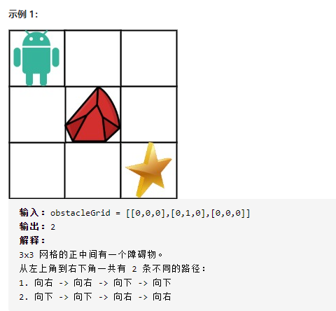
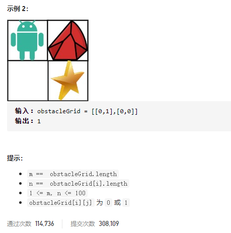
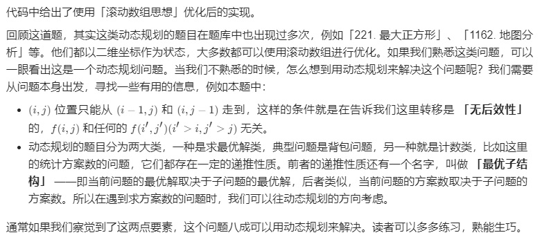

### leetcode_63_medium_不同路径Ⅱ






```c++
class Solution {
public:
    int uniquePathsWithObstacles(vector<vector<int>>& obstacleGrid) {

    }
};
```

#### dp算法

```c++
class Solution {
public:
	int uniquePathsWithObstacles(vector<vector<int>>& obstacleGrid) {
		int height= obstacleGrid.size(), width= obstacleGrid[0].size(), y, x;
		vector<int> dp(width);

		//第0行
		dp[0] = 1 - obstacleGrid[0][0];
		for (x = 1; x < width; x++)
		{
			if (obstacleGrid[0][x])
				dp[x] = 0;
			else
				dp[x] = dp[x - 1];
		}
		//1~height-1行
		for (y = 1; y < height; y++)
		{
			dp[0] = obstacleGrid[y][0] ? 0 : dp[0];
			for (x = 1; x < width; x++)
				dp[x] = obstacleGrid[y][x] ? 0 : dp[x - 1] + dp[x];
		}
		return dp[width - 1];
	}
};
```

#### 什么时候该用dp

leetcode题解对于**什么时候该用dp**的总结：

