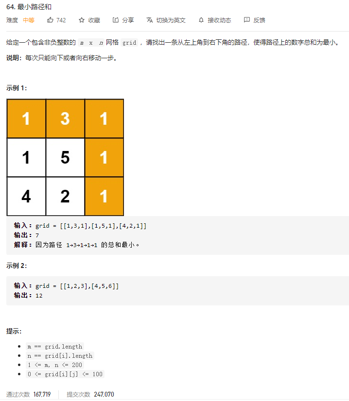

### leetcode_64_medium_最小路径和



```c++
class Solution {
public:
    int minPathSum(vector<vector<int>>& grid) {

    }
};
```

#### dp算法

```c++
class Solution {
public:
	int minPathSum(vector<vector<int>>& grid) {
		int height = grid.size(), width = grid[0].size(), y, x;
		vector<vector<int>> dp(grid);

		//首行
		for (x = 1; x < width; x++)
			dp[0][x] += dp[0][x - 1];
		//[1,height-1]行
		for (y = 1; y < height; y++)
		{
			//首列
			dp[y][0] += dp[y - 1][0];
			//[1,width-1]列
			for (x = 1; x < width; x++)
			{
				dp[y][x] += min(dp[y - 1][x], dp[y][x - 1]);
			}
		}
		return dp[height - 1][width - 1];
	}
};
```

