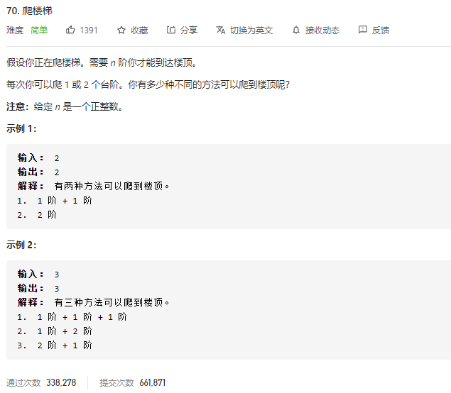

### leetcode_70_easy_爬楼梯



```c++
class Solution {
public:
    int climbStairs(int n) {

    }
};
```

#### dp算法

```c++
class Solution {
public:
	int climbStairs(int n) {
		vector<int> dp(n);

		if (n == 1)
			return 1;
		else if (n == 2)
			return 2;
		dp[0] = 1;
		dp[1] = 2;
		for (int i = 2; i < n; i++)
		{
			dp[i] = dp[i - 1] + dp[i - 2];
		}
		return dp[n - 1];
	}
};
```

