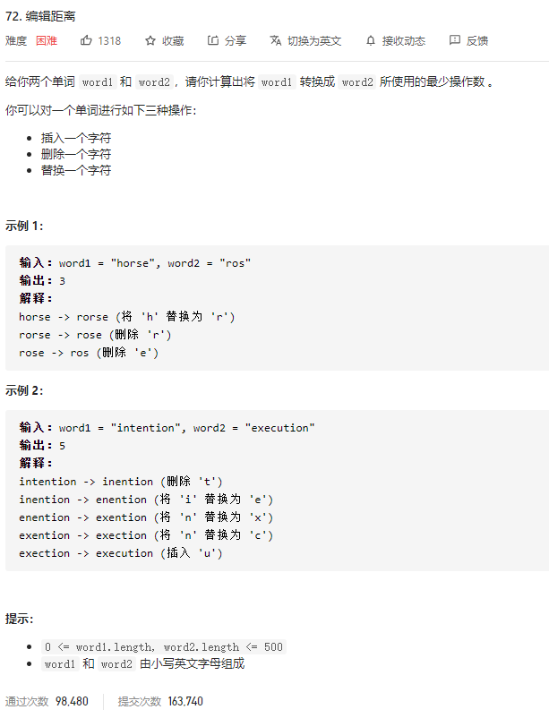

### leetcode_72_hard_编辑距离



```c++
class Solution {
public:
    int minDistance(string word1, string word2) {

    }
};
```

#### 算法思路

构造dp数组distance[i] [j]，记录words1的前i个字符，转换为words2的前j个字符 所需的最少操作数。讨论状态转移方程

- distance[i] [0]=i。需要减去i个字符
- distance[0] [j]=j。需要添加j个字符
- 对于distance[i] [j]，i>0且j>0。取一下情况当中的最小值
  - 如果word1[i]==word2[j]，可以以distance[i-1] [j-1]的转换方式为基础，添加word1[i]这个字符，就构成了distance[i] [j]的转换，此时，distance[i] [j]=distance[i-1] [j-1]
  - 如果word1[i]!=word2[j]，可以以distance[i-1] [j-1]的转换方式为基础，修改word1[i]，就构成了distance[i] [j]的转换，此时，distance[i] [j]=distance[i-1] [j-1]
  - 以distance[i-1] [j]的转换方式为基础，添加word1[i]，此时，distance[i] [j]=distance[i-1] [j]+1
  - 以distance[i] [j-1]的转换方式为基础，添加word2[j]，此时，distance[i] [j]=distance[i] [j-1]+1

```c++
class Solution {
public:
	int minDistance(string word1, string word2) {
		int i, j, minimum;
		int size1 = word1.size(), size2 = word2.size();
		vector<vector<int>> distance(size1 + 1, vector<int>(size2+1));  //word1的前i个字符，到word2的前j个字符的最小转换距离

		//word1或word2为空的情况
		for (j = 0; j <= size2; j++)
			distance[0][j] = j;
		for (i = 0; i <= size1; i++)
			distance[i][0] = i;
		//word1和word2都非空的情况
		for (i = 1; i <= size1; i++)
		{
			for (j = 1; j <= size2; j++)
			{
				minimum = INT_MAX;
				if (word1[i - 1] == word2[j - 1])
					minimum = min(minimum, distance[i - 1][j - 1]);
				else
					minimum = min(minimum, distance[i - 1][j - 1] + 1);
				minimum = min(minimum, distance[i - 1][j] + 1);
				minimum = min(minimum, distance[i][j - 1] + 1);
				distance[i][j] = minimum;
			}
		}

		return distance[size1][size2];
	}
};
```

