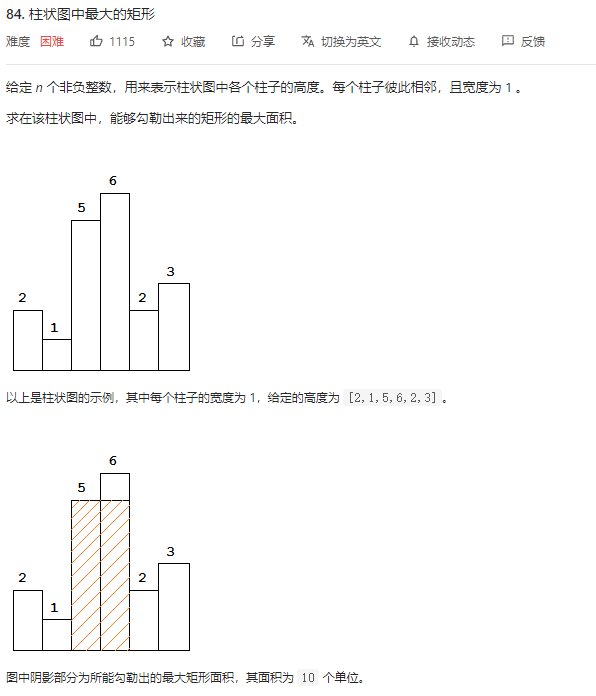
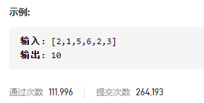
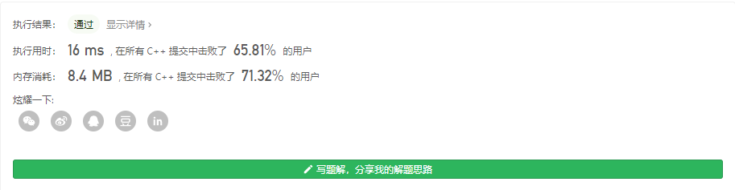
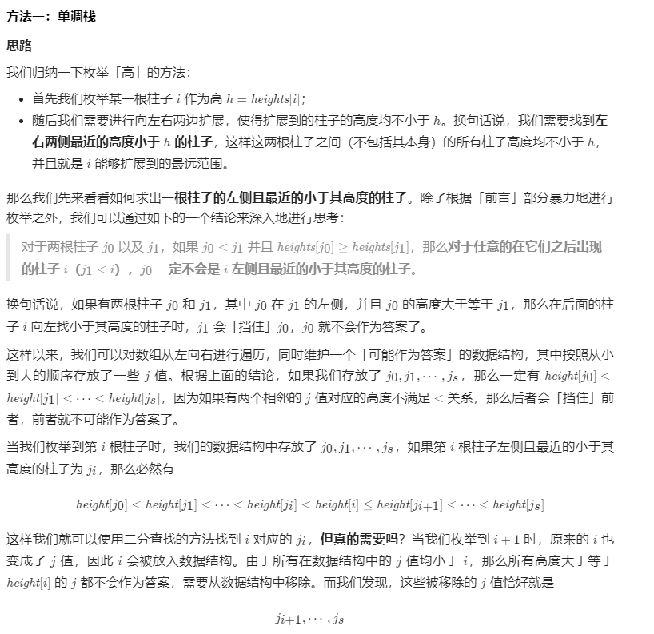
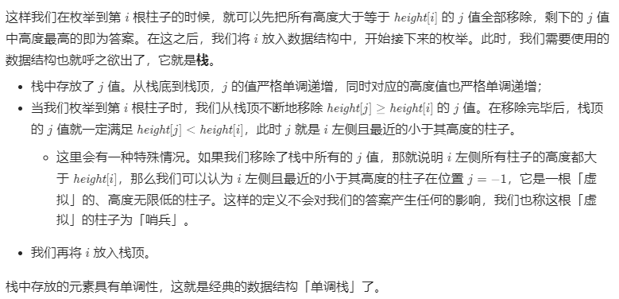
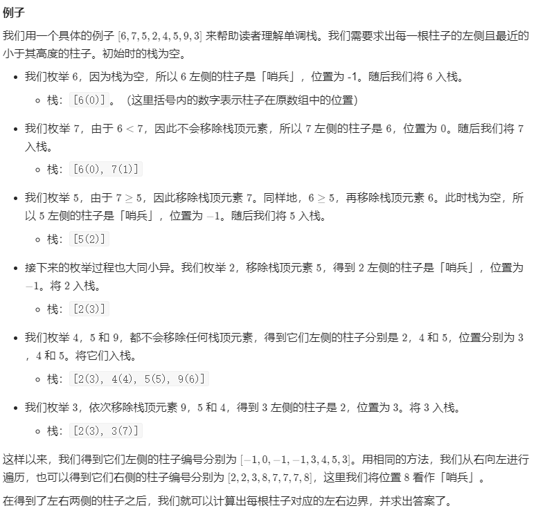
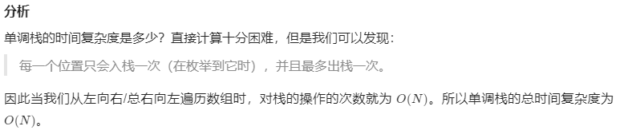

### leetcode_84_hard_柱状图中最大的矩形





```c++
class Solution {
public:
    int largestRectangleArea(vector<int>& heights) {
        
    }
};
```

#### dp算法

##### dp数组的规定

考虑使用dp算法。

对于每一根柱子，考虑以第n根柱子作为右端点，以heights[n]作为矩形右端点的高度；或者以第n根柱子作为左端点，以heights[n]作为矩形左端点的高度。这两种情况，并不一定就能囊括最终结果的情况，所以不适合作为dp的条件。

例如，测试用例[1,7,5,6,1]  最大的矩形应该是heights[1]到heights[3]范围内的，宽度为3，高度为5的矩形。它不以heights[1]=7的高度作为左端点。也不以heights[3]=6的高度作为右端点。

因此，讨论矩形的高度时，分别讨论以**每个柱子作为矩形最高点，所能获得的最大矩形面积**

例如，对于上面的测试用例，如果以nums[1]=7作为最高点，则矩形宽度为1，高度为7，面积为7。如果以nums[2]=5作为最高点，则矩形宽度为3，高度为5，面积为15。

因此，也就需要讨论以每个柱子作为最高点的矩形，分别是从这根柱子 向左/向右扩展几格而获得的。

因此，考虑状态转移方程，expandLeft，代表从左侧相邻的柱子中，有多少个大于等于当前柱子高度，expandRight，代表右侧相邻的元素中，有多少个大于等于当前柱子高度

##### 状态转移方程

以expandLeft为例。讨论expandLeft[i]

对于heights[i-1]>heights[i]的情况，则i-1柱子所能向左扩展的元素，也同样能够应用于i。所以，如果heights[i-1]>heights[i]，则可以expandLeft[i]+=expandLeft[i-1]。再继续向左扩展，同理

##### 结果的计算

对于每一根柱子，都讨论以它作为矩形最高点，尽可能向左、向右扩展，所能获得的矩阵大小

heights[i] * (expandLeft[i] + expandRight[i] + 1)

取这当中的最大值即可

```c++
class Solution {
public:
	int largestRectangleArea(vector<int>& heights) {
		int i, j, result;
		vector<int> expandLeft(heights.size(), 0);  //左侧相邻的柱子中，有多少个大于等于当前柱子高度
		vector<int> expandRight(heights.size(), 0);  //右侧相邻的元素中，有多少个大于等于当前柱子高度

		//计算expandLeft
		for (i = 0; i < heights.size(); i++)
		{
			j = i - 1;
			while (j >= 0 && heights[j] >= heights[i])  //尽量向左扩展
			{
				expandLeft[i] += expandLeft[j] + 1;
				j -= expandLeft[j] + 1;
			}
		}
		//计算expandRight
		for (i = heights.size() - 1; i >= 0; i--)
		{
			j = i + 1;
			while (j < heights.size() && heights[j] >= heights[i])  //尽量向右扩展
			{
				expandRight[i] += expandRight[j] + 1;
				j += expandRight[j] + 1;
			}
		}
		//以每一根柱子作为矩形最矮处，计算最大矩形
		for (i = 0,result=0; i < heights.size(); i++)
			result = max(result, heights[i] * (expandLeft[i] + expandRight[i] + 1));

		return result;
	}
};
```



#### 单调栈

参考leetcode官方题解https://leetcode-cn.com/problems/largest-rectangle-in-histogram/solution/zhu-zhuang-tu-zhong-zui-da-de-ju-xing-by-leetcode-/










```c++
class Solution {
public:
    int largestRectangleArea(vector<int>& heights) {
        int n = heights.size();
        vector<int> left(n), right(n);
        
        stack<int> mono_stack;
        for (int i = 0; i < n; ++i) {
            while (!mono_stack.empty() && heights[mono_stack.top()] >= heights[i]) {
                mono_stack.pop();
            }
            left[i] = (mono_stack.empty() ? -1 : mono_stack.top());
            mono_stack.push(i);
        }

        mono_stack = stack<int>();
        for (int i = n - 1; i >= 0; --i) {
            while (!mono_stack.empty() && heights[mono_stack.top()] >= heights[i]) {
                mono_stack.pop();
            }
            right[i] = (mono_stack.empty() ? n : mono_stack.top());
            mono_stack.push(i);
        }
        
        int ans = 0;
        for (int i = 0; i < n; ++i) {
            ans = max(ans, (right[i] - left[i] - 1) * heights[i]);
        }
        return ans;
    }
};

作者：LeetCode-Solution
链接：https://leetcode-cn.com/problems/largest-rectangle-in-histogram/solution/zhu-zhuang-tu-zhong-zui-da-de-ju-xing-by-leetcode-/
来源：力扣（LeetCode）
著作权归作者所有。商业转载请联系作者获得授权，非商业转载请注明出处。
```

