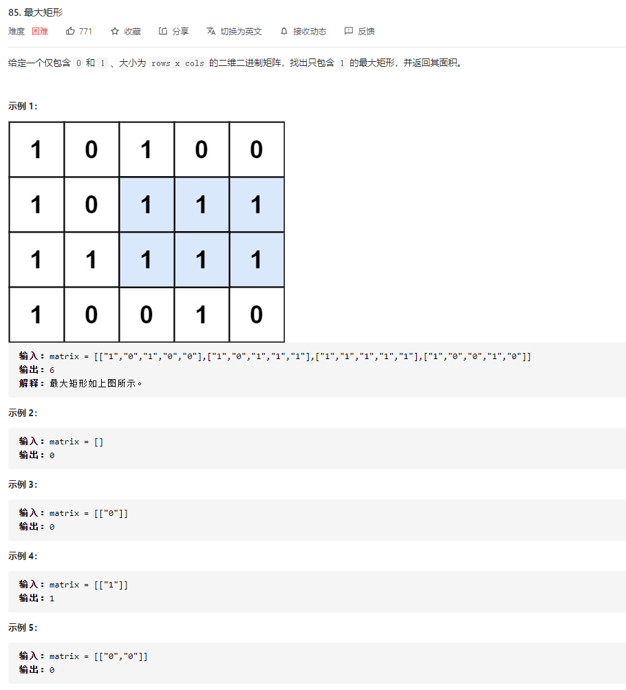
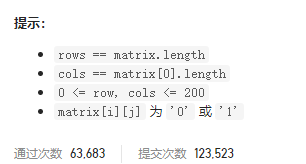
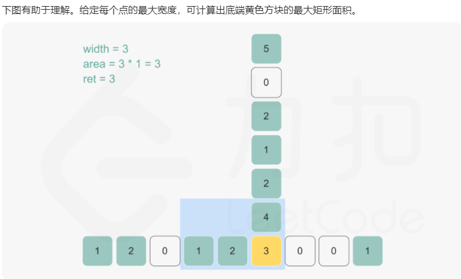
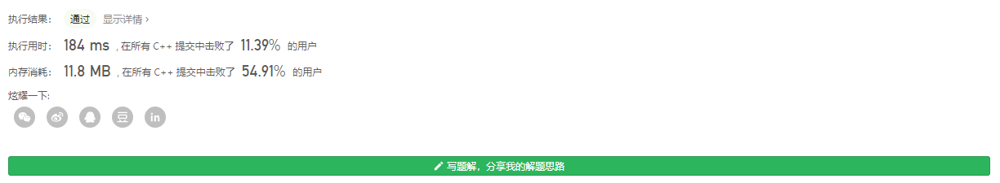
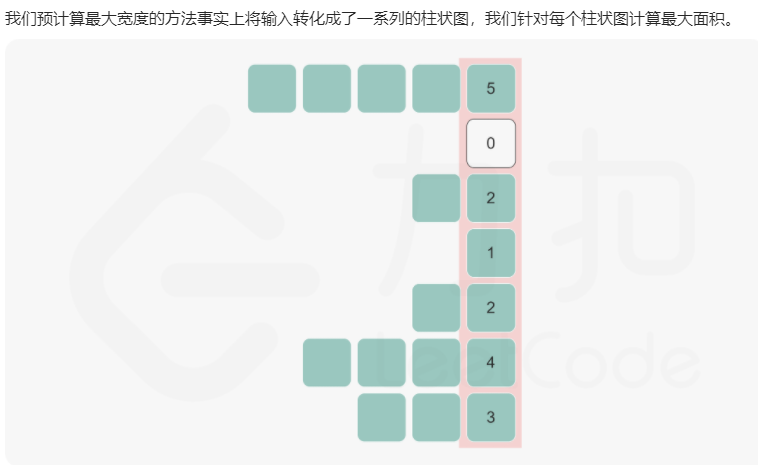

### leetcode_85_hard_最大矩形





```c++
class Solution {
public:
    int maximalRectangle(vector<vector<char>>& matrix) {

    }
};
```

#### 使用柱状图的暴力算法

本题与leetcode_84_hard_柱状图中的最大矩形 类似。

构造dp矩阵，left，记录(y,x)点左侧有多少个相邻的'1'，包括他本身。

对于每一个位置(y,x)，以它作为矩形的右下端点，向上查找，找到最大的矩形。



该方法时间复杂度O(width^2*height)



#### 单调栈

类似leetcode_84_hard_柱状图中的最大矩形 的算法，使用单调栈。

1. 首先，扫描整个matrix，构造二维数组left。left[y] [x]表示，(y,x)点左侧有多少个相邻的'1'，包括[y] [x]这个元素本身
2. 对于二维数组的每一列，分别讨论，以这一列为右边界，所能得到的最大矩形面积。这就转化为了leetcode_84_hard_柱状图中的最大矩形 的问题。
   1. 维护一个长度为height的数组vector<int> up，up[y]记录着以matrix[y] [x]为矩形最宽位置，矩形的上边界的高度(不包含)。 例如,对于图中第4列的元素，left[3] [x]=1。以它为矩形最高点，则上边界为left[1] [x]=0。
      - 维护一个单调栈stack<int> stk。记录当前需要讨论的矩形上边界。
      - 例如，当讨论到y=1时，此时stk中只有一个元素。stk.top()=0，对应的位置left[0] [x]=5
      - 当讨论到y=1时，y=1以及之后y>=1对应的各个位置，都只可能是以left[1] [x]=0为上边界，不可能以left[0] [x]=5为上边界。所以，可以将0从stk中移除。
      - 对于stk中与left[1] [x]相等的元素（如果有的话）。在讨论以后的元素时，left[1] [x]总可以代替之前的那个元素，发挥边界的作用。所以，仍然可以移除这个元素
      - 在上一步中，所有大于等于left[1] [x]的元素，都已经被移除。此时 stk.top()也就是(1,x)处对应的上边界。
   2. 维护一个长度为height的数组vector<int> down，down[y]记录着以matrix[y] [x]为矩形最宽位置，矩形的下边界的高度(不包含)。
   3. 分别讨论，对于给定的x，以每一个left[y] [x]为矩形最宽处，得到的矩形的大小。

```c++
class Solution {
public:
    int maximalRectangle(vector<vector<char>>& matrix) {
        int width, height, x, y, area,recWidth,  k, result;
        if (matrix.empty() || matrix[0].empty())
            return 0;
        width = matrix[0].size();
        height = matrix.size();
        vector<int> up(height, -1);  //始于各个y的矩形上界(不包含)
        vector<int> down(height, width);  //始于各个y的矩形下界(不包含)
        stack<int> stk;  //单调栈
        vector<vector<int>> left(height, vector<int>(width, 0));  //各个位置，左侧有几个连续的'1' (包括本身)

        //构造left
        for (y = 0; y < height; y++)
        {
            left[y][0] = matrix[y][0] == '1' ? 1 : 0;
            for (x = 1; x < width; x++)
            {
                if (matrix[y][x] == '1')
                    left[y][x] = left[y][x - 1] + 1;
            }
        }
        //对于每一列，以“柱状图中的最大矩形”的方法，计算以这一列为右边界的最大矩形面积
        result = 0;
        for (x = 0; x < width; x++)
        {
            //计算各个位置的上边界
            stk = stack<int>();
            for (y = 0; y < height; y++)  
            {
                while (!stk.empty() && left[stk.top()][x] >= left[y][x])  //清空大于等于left[y][x]的元素
                    stk.pop();
                up[y] = stk.empty()?-1:stk.top();
                stk.push(y);  //left[y][x]会成为新的 用于限定数组上边界的元素
            }
            //计算各个位置的下边界
            stk = stack<int>();
            for (y = height - 1; y >= 0; y--)
            {
                while (!stk.empty() && left[stk.top()][x] >= left[y][x])  //清空大于等于left[y][x]的元素
                    stk.pop();
                down[y] = stk.empty() ? height : stk.top();
                stk.push(y);  //left[y][x]会成为新的 用于限定数组下边界的元素
            }
            //计算最大矩形
            for (y = 0; y < height; y++)
            {
                result = max(result, left[y][x] * (down[y] - up[y] - 1));
            }
        }
        return result;
    }
};
```

