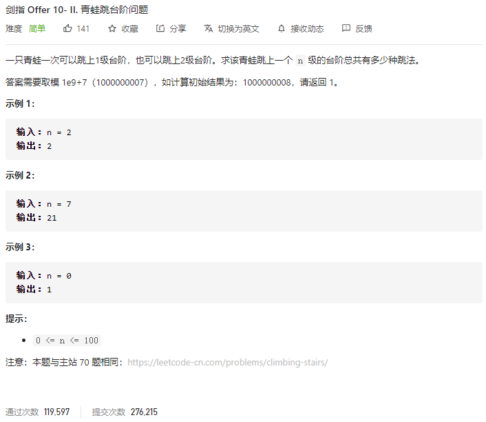

### 剑指offer_10.2_easy_青蛙跳台阶问题



```c++
class Solution {
public:
    int numWays(int n) {

    }
};
```

#### 算法思路

同 剑指offer_10.1_easy_斐波那契数列.md

```c++
class Solution {
public:
    int numWays(int n) {
        int i,fformer,former,cur;  //前1个 前2个元素
        static int DIVISOR=1000000007;
        
        if(n==0)
            return 1;
        else if(n==1)
            return 1;
        fformer=1;
        former=1;
        for(i=2;i<=n;i++)
        {
            cur=fformer+former;
            if(cur>DIVISOR)
                cur=cur%DIVISOR;
            fformer=former;
            former=cur;
        }
        return former;
    }
};
```

