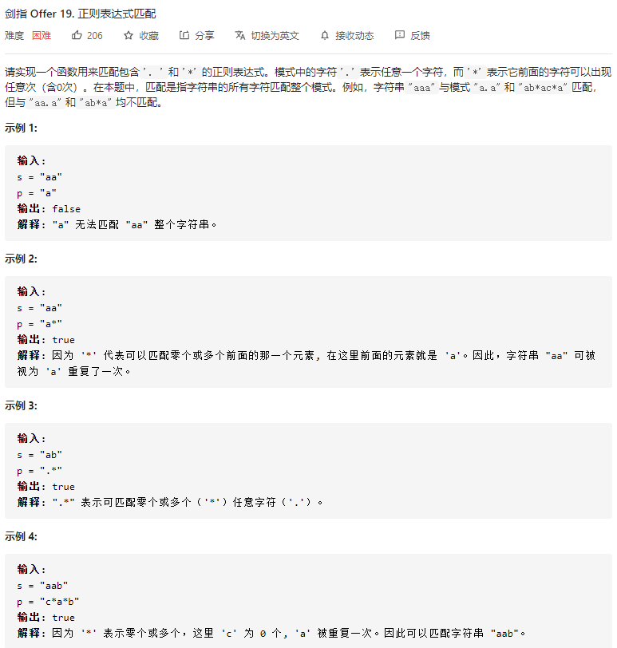
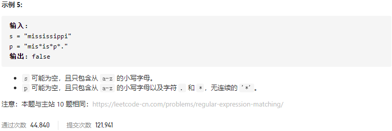

### 剑指offer_19_hard_正则表达式匹配





```c++
class Solution {
public:
    bool isMatch(string s, string p) {

    }
};
```

#### 算法思路

同 leetcode_10_hard_正则表达式匹配

```c++
class Solution {
public:
	bool isMatch(string s, string p) {
		int i, j;
		vector<vector<bool>> match;  //s的前i个字符(下标从1开始)，与p的前j个字符(下标从1开始) 是否匹配

		match = vector<vector<bool>>(s.size() + 1, vector<bool>(p.size() + 1, false));
		//首行
		match[0][0] = true;
		for (j = 1; j <= p.size(); j++)
			match[0][j] = p[j - 1] == '*' ? match[0][j - 2] : false;
		//以下各行
		for (i = 1; i <= s.size(); i++)
		{
			match[i][0] = false;  //空模板无法与任何非空字符串匹配
			for (j = 1; j <= p.size(); j++)
			{
				if (p[j - 1] == '.')
					match[i][j] = match[i - 1][j - 1];
				else if ('a' <= p[j - 1] && p[j - 1] <= 'z')
					match[i][j] = s[i - 1] == p[j - 1] ? match[i - 1][j - 1] : false;
				else  //遇到了'*'
				{
					//不匹配任何字符
					if (match[i][j - 2])
						match[i][j] = true;
					//至少匹配一个任意字符
					else if (p[j - 2] == '.')
						match[i][j] = match[i - 1][j];
					//至少匹配一个特定字符
					else
						match[i][j] = s[i - 1] == p[j - 2] ? match[i - 1][j] : false;
				}
			}
		}
		return match[s.size()][p.size()];
	}
};
```

