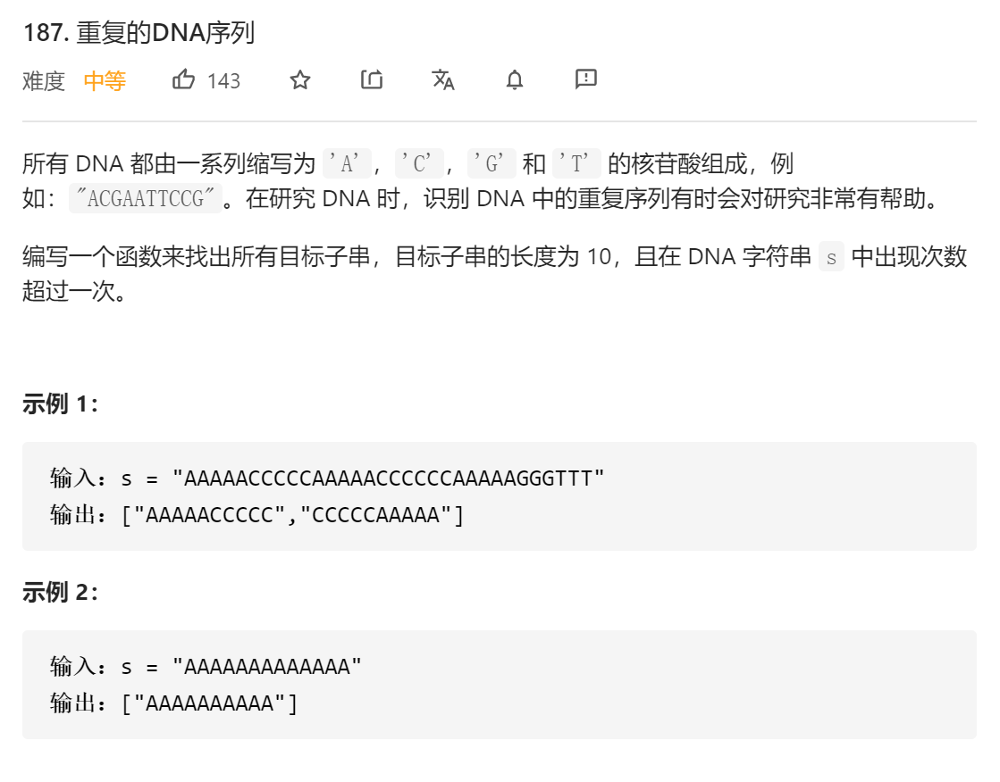
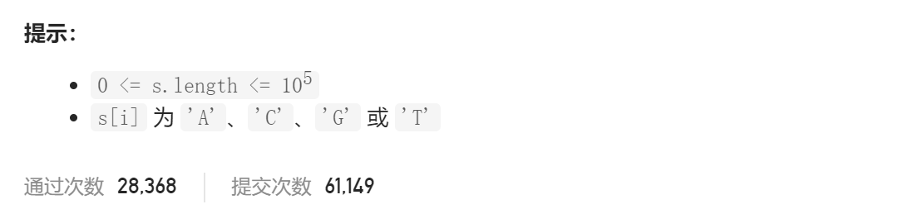

### leetcode_187_medium_重复的DNA序列





```c++
class Solution {
public:
    vector<string> findRepeatedDnaSequences(string s) {

    }
};
```

#### 算法思路

用set来处理“重复出现”。问题是，set的key值用什么才更加高效。

考虑将将长度为10的字符串，记录为长度为10的4进制数。这种数值方便迭代处理

```c++
class Solution {
public:
	vector<string> findRepeatedDnaSequences(string s) {
		int r,curVal,i;
		int char2Int[127];
		char int2Char[4] = { 'A','C','G','T' };
		unordered_map<int,int> existNum;
		vector<string> result;

		char2Int['A'] = 0;
		char2Int['C'] = 1;
		char2Int['G'] = 2;
		char2Int['T'] = 3;

		//统计各个数值出现的次数
		if (s.size() < 10)
			return result;
		for (r = 9,curVal=0; r >=0; r--)
		{
			curVal *= 4;
			curVal += char2Int[s[r]];
		}
		existNum[curVal]++;
		for (r = 10; r < s.size(); r++)
		{
			curVal = curVal >> 2;  //移除最前面的一位字符
			curVal += char2Int[s[r]] << 18;  //添加最新的一个字符
			existNum[curVal]++;
		}

		//存储重复出现的字符
		for (auto it = existNum.begin(); it != existNum.end(); it++)
		{
			if (it->second > 1)
			{
				string s="";
				curVal = it->first;
				for (i = 0; i < 10; i++)
				{
					s += int2Char[curVal % 4];
					curVal = curVal >> 2;
				}
				result.push_back(s);
			}
		}
		return result;
	}
};
```

