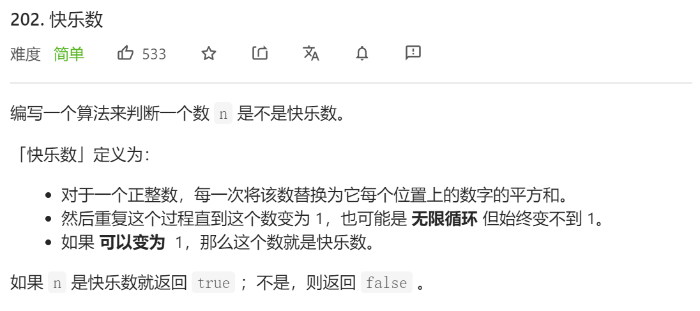
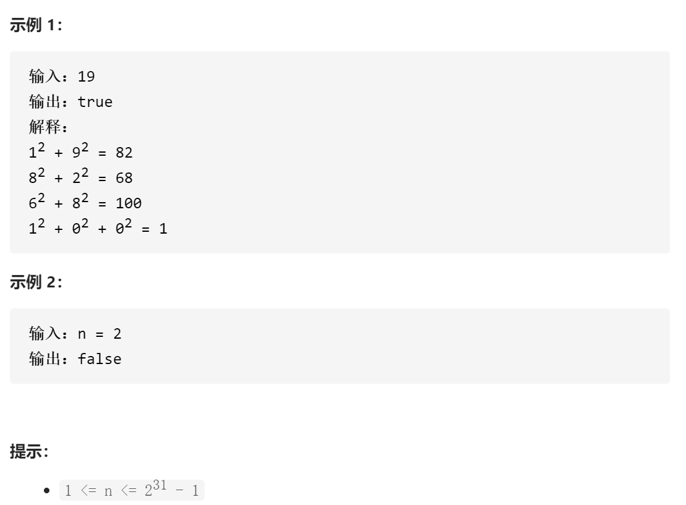

### leetcode_202_easy_快乐数





```c++
class Solution {
public:
    bool isHappy(int n) {

    }
};
```

#### 算法思路

判断一个数是否能够变为1 很麻烦，但是可以判断一个数是否 **不是快乐数**，即判断该数是否会陷入**无限循环**

```c++
class Solution {
public:
	bool isHappy(int n) {
		int next;
		unordered_set<int> existN;  //循环过程中出现过的数

		while (n != 1)
		{
			//判断该数是否重复出现
			if (existN.find(n) != existN.end())
				break;
			existN.insert(n);
			//计算下一个数
			next = 0;
			while (n != 0)
			{
				next += pow(n % 10, 2);
				n /= 10;
			}
			n = next;
		}
		if (n == 1)
			return true;
		else
			return false;
	}
};
```

