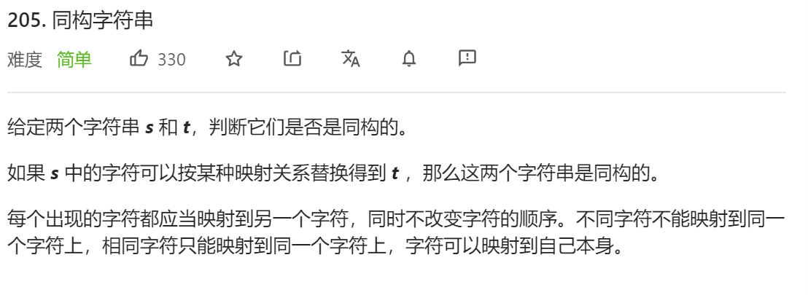
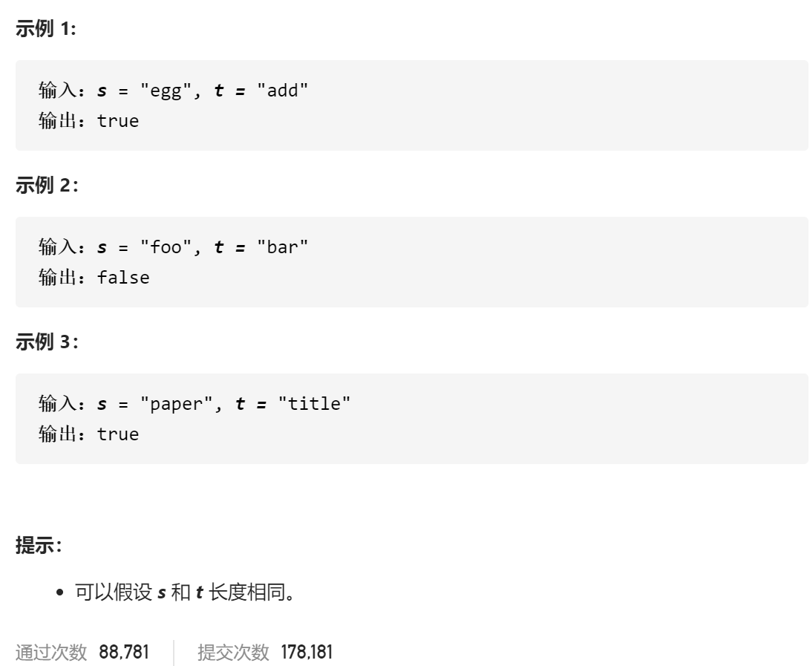

### leetcode_205_easy_同构字符串





```c++
class Solution {
public:
    bool isIsomorphic(string s, string t) {

    }
};
```

#### 算法思路

用一个数组来存储这种映射关系即可。虽然本题考察hashmap，但是数组更加高效

```c++
class Solution {
public:
	bool isIsomorphic(string s, string t) {
		int i;
		int count[128];  //统计映射为各个字符的数量
		char map[128];  //字符映射关系表

		memset(map, 0, sizeof(char) * 128);
		//字符串长度相等 是同构的前提
		if (s.size() != t.size())
			return false;
		//判断每个字符 是否能够分别映射为某个字符
		for (i = 0; i < s.size(); i++)
		{
			if (map[s[i]] == 0)  //还没有存储s[i]的映射关系的情况
				map[s[i]] = t[i];
			else if (map[s[i]] != t[i])  //已经存储了s[i]的映射关系,且映射关系有矛盾
				return false;
			else  //已经存储了s[i]的映射关系，且未发生矛盾
				;
		}
		//判断是否有多个字符映射到同一个字符的情况
		memset(count, 0, sizeof(int) * 128);
		for (i = 0; i < 128; i++)
		{
			if (map[i] == 0)
				continue;
			if (++count[map[i]] > 1)
				return false;
		}

		return true;
	}
};
```

