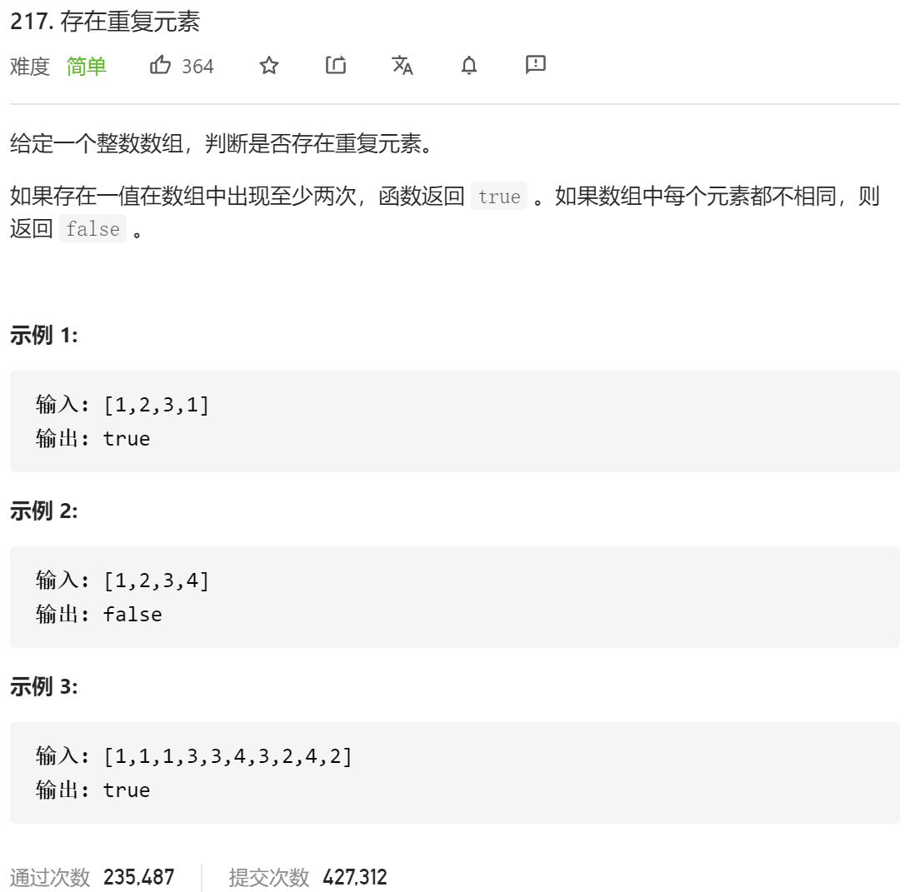

### leetcode_217_easy_存在重复元素



```c++
class Solution {
public:
    bool containsDuplicate(vector<int>& nums) {

    }
};
```

#### 算法思路

考察unordered_set的使用

```c++
class Solution {
public:
	bool containsDuplicate(vector<int>& nums) {
		int i;
		unordered_set<int> exist;

		for (i = 0; i < nums.size(); i++)
		{
			if (exist.find(nums[i]) != exist.end())
				return true;
			exist.insert(nums[i]);
		}
		return false;
	}
};
```

