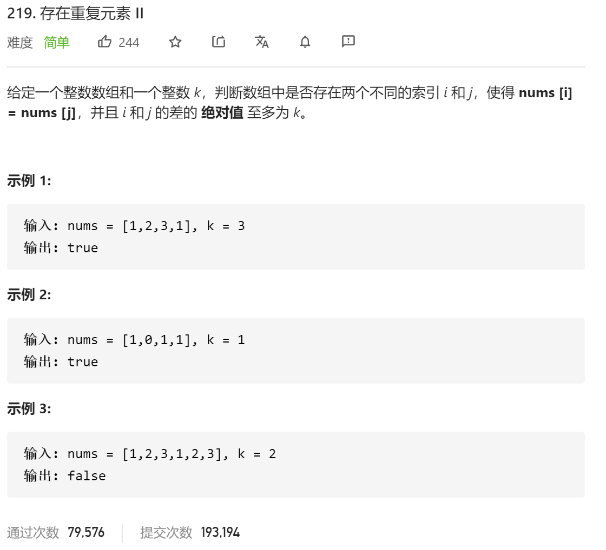

### leetcode_219_easy_存在重复元素 Ⅱ



```c++
class Solution {
public:
    bool containsNearbyDuplicate(vector<int>& nums, int k) {

    }
};
```

#### 算法思路

不同于 leetcode_217_easy_存在重复元素 ，本题需要维护一个区间内的数字出现次数

```c++
class Solution {
public:
	bool containsNearbyDuplicate(vector<int>& nums, int k) {
		int l, r;
		unordered_map<int, int> existTime;  //在长度为k的区间内，各个数字出现的次数

		for (r = 0; r < k && r<nums.size(); r++)
		{
			if (++existTime[nums[r]] > 1)
				return true;
		}
		for (l = 0, r = k; r < nums.size(); l++,r++)
		{
			if (++existTime[nums[r]] > 1)
				return true;
			--existTime[nums[l]];
		}
		return false;
	}
};
```

