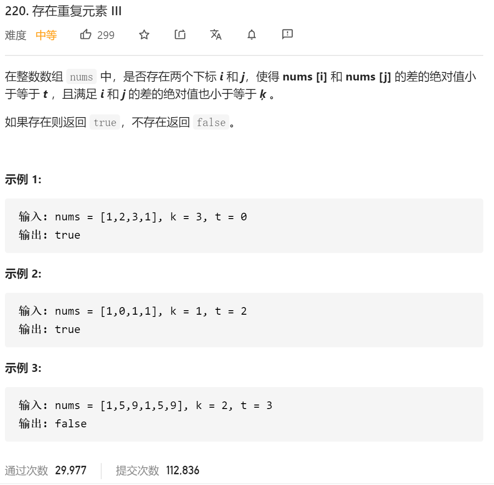

### leetcode_220_medium_存在重复元素 Ⅲ



```c++
class Solution {
public:
    bool containsNearbyAlmostDuplicate(vector<int>& nums, int k, int t) {

    }
};
```

#### 算法思路

类似 leetcode_219_easy_存在重复元素 Ⅱ ，维护一个大小为k的滑动窗口。每当取到一个新元素，就比较窗口内是否有元素与当前元素相距小于t。

本题的考察点在于，滑动窗口内的元素用何种数据结构存储。用一个有序的vector<int> 作插入排序 固然是可以的。但是插入、删除的时间复杂度均为O(n)，算法的总时间复杂度为O(n^2)。时间复杂度过高。

参考题解[简单易懂的c++解法 - 存在重复元素 III - 力扣（LeetCode） (leetcode-cn.com)](https://leetcode-cn.com/problems/contains-duplicate-iii/solution/jian-dan-yi-dong-de-cjie-fa-by-zhu-que-3-4p53/)。使用一个set<int> 来维护滑动窗口元素。set底层为红黑树，插入、删除、查找操作 均为O(log N)时间复杂度。

- lower_bound(): 二分查找一个有序数列，返回第一个大于等于x的数，如果没找到，返回末尾的迭代器位置
- upper_bound(): `set::upper_bound`和 Java 中的`TreeSet::floor`有点微妙的不同。为了遵循区间的左闭右开原则，`set::upper_bound`返回的是小于等于目标元素的最大元素的后一个元素（即大于目标元素的最小元素），所以要对返回的迭代器进行自减操作。


来自官方题解评论区


```c++
class Solution {
public:
    bool containsNearbyAlmostDuplicate(vector<int>& nums, int k, int t) {
        int i;
        set<long> elems;  //滑动窗口元素
        set<long>::iterator it;

        for (i = 0; i < nums.size(); i++)
        {
            //判断是否有重复元素
            it = elems.lower_bound(nums[i]);  //大于等于nums[i]的元素当中 最小的一个
            if (it != elems.end() && *it - (long)nums[i] <= t)
                return true;
            it = elems.upper_bound(nums[i]);  //小于等于nums[i]的元素当中 最大的一个的后一个迭代器
            if (it != elems.begin() && (long)nums[i] - *--it <= t)
                return true;
            //维护滑动窗口
            elems.insert(nums[i]);
            if (i >= k)
                elems.erase(nums[i - k]);  //可以直接删除 此处不会有重复元素
        }
        return false;
    }
};
```

