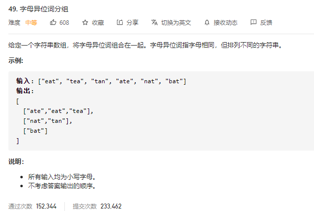

### leetcode_49_字符异位词分组



```c++
class Solution {
public:
    vector<vector<string>> groupAnagrams(vector<string>& strs) {

    }
};
```

#### 算法思路

要解决的核心问题是，**字母异位词的判据是什么**

采用的方法是，将字符串排序，排序后的字符串作为分组的key。

```c++
class Solution {
public:
	vector<vector<string>> groupAnagrams(vector<string>& strs) {
		int i, size = strs.size();
		string curStr;
		unordered_map<string, vector<string>> strMap;
		unordered_map<string, vector<string>>::iterator iter;
		vector<vector<string>> result;

		//用hashmap来匹配字符串
		for (i = 0; i < size; i++)
		{
			curStr = strs[i];
			sort(curStr.begin(), curStr.end());  //用排序数组 来作为字符串分类的key
			strMap[curStr].push_back(strs[i]);
		}
		//生成结果
		for (iter = strMap.begin(); iter != strMap.end(); iter++)
		{
			result.push_back(iter->second);
		}
		return result;
	}
};
```

